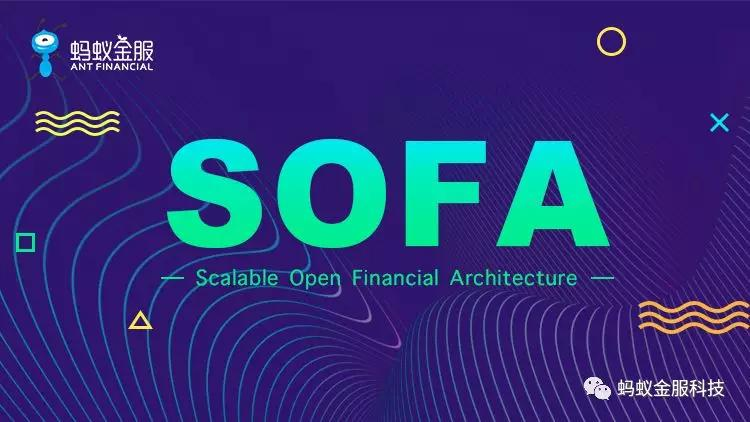

我们很高兴地宣布，今天**蚂蚁金服启动分布式中间件（Scalable Open Financial Architecture，以下简称 SOFA 中间件）的开源计划！**

SOFA 是蚂蚁金服**自主研发**的金融级分布式中间件，包含了构建金融级云原生架构所需的各个组件，包括微服务研发框架，RPC 框架，服务注册中心，分布式定时任务，限流/熔断框架，动态配置推送，分布式链路追踪，Metrics监控度量，分布式高可用消息队列，分布式事务框架，分布式数据库代理层等组件，是一套分布式架构的完整的解决方案，也是在金融场景里锤炼出来的最佳实践。

蚂蚁金服期望通过逐步向社区开源 SOFA 中各个组件，来帮助更多机构和合作伙伴完成金融分布式转型，帮助大家更加快速构建稳定的金融级云原生的架构，也期望 SOFA 在蚂蚁体系之外的更大场景下去应用，来进一步锻造改进这套体系，使其更加完善和稳固，并具备更多金融级的属性。所以我们也非常欢迎社区的伙伴和各行业的伙伴能够参与共同探讨、交流和共建。

## Why（为什么要做）

SOFA 中间件在蚂蚁内部经历了十年的发展和四代架构的演进，被广泛应用在包括支付，借贷，信用，基金，保险等全金融场景，**支撑着蚂蚁平稳度过历次双十一，双十二，新春红包等大考，创造了25.6 w/s 的交易记录，并还在不断刷新这个记录**。

从 2015 年开始，蚂蚁金服开启了金融科技对外输出的战略，SOFA 也走出了蚂蚁，甚至跨越了国界，被更多金融机构与合作伙伴所使用，如天弘基金，信美互信，南京银行，PayTM、DANA钱包等。

在与合作伙伴以及客户的沟通、合作过程中，我们发现了 SOFA 的理念和能力也正是很多金融行业的企业所需要的，大家或多或少正在规划或者已经在做类似的东西，但缺乏像蚂蚁金服这么大的流量来提供考验，也缺乏专业团队的长期投入，更缺乏丰富的金融场景和严苛的业务压力来驱动技术持续发展。

随着近几年蚂蚁金服在生态构建上不断完善，以及不断地有更多的公司加入到蚂蚁金服的金融生态中，我们也发现了整个金融生态地复杂性和多样性，SOFA 中间件也需要在更多地场景下被打磨、被完善、被增强。因此，我们选择将 SOFA 逐步开源出来，在贡献给社区的同时，也期待社区、合作伙伴甚至客户，都能够一起参与共建，形成行业标准和最佳实践。

## How（怎么做）

为了让 SOFA 能够开源出来，我们投入了大量的重构工作，以可扩展化的方式来层层构建 SOFA 的能力，保证 SOFA 的内部版本和开源的版本采用的是同一个内核。所以 SOFA 的内部版本就是在开源版本之上扩展了内部逻辑和历史版本的兼容逻辑。开源版本的核心逻辑，内外是一致的，并在蚂蚁金服的生产环境中被广泛使用的，同时会随着蚂蚁自身业务诉求的驱动，不断的演进。

开源社区有非常多优秀的技术和丰富的生态，为了更好的能融入和对接现有技术体系，尊重并遵守一些社区标准，**SOFA 在设计过程中就充分考虑了兼容性和架构分层，充分兼容适配社区标准，实现组件化、可扩展、可替换**。

所有的 SOFA 中间件中的组件组合起来可以发挥更大的能力，但是每一个组件都是可以被替换的，比如用户可以选择用 Dubbo 来替换 SOFARPC，或者跟 SOFARPC 对接互通；可以选择 Zookeeper 来作为服务注册发现，也可以选择 SOFA 的服务注册中心来做服务发现；分布式链路追踪组件遵守 OpenTracing 的规范，可以直接和 Zipkin 进行对接等等；Metrics组件会遵循 Metrics2.0 标准，适配 Prometheus 体系等等。

## What（要做什么）

本次 SOFA 中间件开源的内容包含了 **SOFABoot** 和 **SOFARPC** 两个组件。

**SOFABoot 是蚂蚁金服基于 Spring Boot 构建一个研发框架**，整体架构上类似于蚂蚁金服之前开源的Egg框架，遵守微内核，可插拔的理念，我们以标准 Spring Boot Starter的方式，扩展了很多企业级特性，以解决大规模团队开发云原生微服务系统中会遇到的问题，如类隔离，ReadinessCheck，日志隔离等等能力，后续会开放更多内部实践过的特性，如 Spring 上下文隔离，合并部署，动态模块，Tracing、Metrics、Streaming、测试框架等。

同时，蚂蚁的很多技术团队和阿里的技术团队也开放了很多类库和组件，我们都会提供原生的集成能力和 Demo，方便大家更好的整合使用。SOFABoot 100% 兼容 Spring Boot，和 Spring Boot 并非是替代的关系，所有 Spring Boot 中的能力也都可以在 SOFABoot 中使用。

SOFABoot 的 Github 的地址是：[https://github.com/sofastack/sofa-boot](https://github.com/sofastack/sofa-boot) ，欢迎大家使用反馈、贡献代码。

**SOFARPC 是一个高效，可靠，可扩展的 RPC 的框架**，是蚂蚁金服服务化架构的基石。SOFARPC 最早源于阿里内部的 HSF，经过了蚂蚁金服内部多年的发展，在协议，网络，路由，可扩展性等层面都进行了大量的改造和优化的工作，适配了更多金融级的场景。

SOFARPC 在蚂蚁金服内部是被所有在线应用的使用的服务调用框架，**截止 2017 年双十一，SOFARPC 已经被蚂蚁 2000 多个系统所使用，生产环境发布的服务数量超过了 23000 个**。

SOFARPC 提供了多协议的支持，包括在蚂蚁金服内部被广泛采用，并且高度优化的 [Bolt](https://github.com/sofastack/sofa-bolt) 协议，以及 REST，Dubbo，gRPC 等等主流的协议；也针对内部网关，测试等等场景提供了泛化调用能力；为了解决超大规模流量的预热的问题，提供了服务预热的能力；用户也可以根据 SOFARPC 的扩展机制扩展自己需要的能力。

在后续的版本中，SOFARPC 将会加上分布式链路追踪，Metrics，更多的服务注册中心的支持，CRC 校验等等能力。

SOFARPC 的 Github 的地址是：[https://github.com/sofastack/sofa-rpc](https://github.com/sofastack/sofa-rpc) ，欢迎大家使用反馈、贡献代码。
 
除了以上的两个 SOFA 中间件中的组件，在接下来，我们将会陆续开源 SOFA 中间件中的其他的组件，目前这些组件正在进行一定程度地重构中，为开源做准备，敬请大家期待~

**附本文中提到的链接：**

- Egg：[http://eggjs.org](http://eggjs.org)
- SOFABoot：[https://github.com/sofastack/sofa-boot](https://github.com/sofastack/sofa-boot)
- SOFARPC：[https://github.com/sofastack/sofa-rpc](https://github.com/sofastack/sofa-rpc)
- SOFABolt：[https://github.com/sofastack/sofa-bolt](https://github.com/sofastack/sofa-bolt)

## 彩蛋

最后，我们也为对 SOFA 中间件感兴趣的小伙伴们准备了一个微信交流群，欢迎感兴趣的同学扫描下方二维码联系加群小助手加入我们 SOFA 交流群哦。👇

