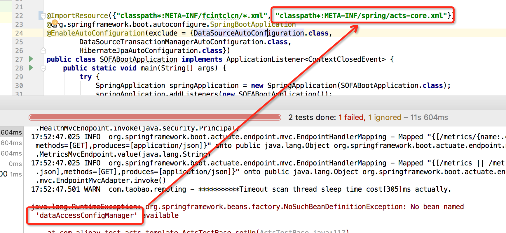
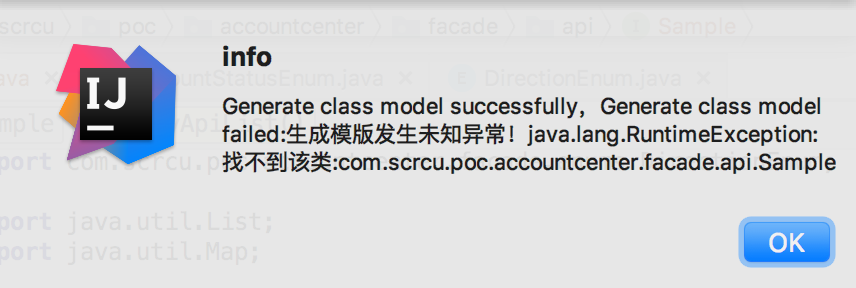
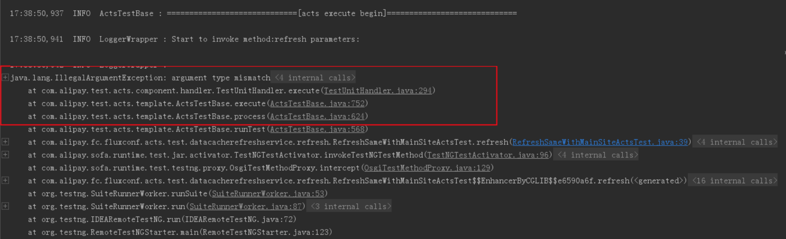
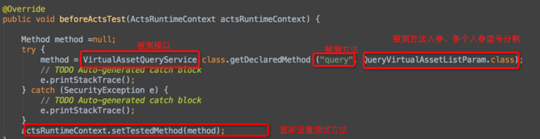

# 常见问题

## Q：报错误 NoSuchMethodError

一般情况下该类错误由依赖冲突导致。已知的依赖冲突列举如下，遇到时选择性排除它们。

### 日志冲突
#### commons-logging 冲突
```xml
<exclusion>
    <artifactId>commons-logging</artifactId>
    <groupId>commons-logging</groupId>
</exclusion>
```

#### logback-classic 冲突
在冲突位置将 logback-classic 排除，如 spring-boot-starter-logging 和 spring-test 为存在冲突的应用依赖。
```xml
<dependency>
    <groupId>org.springframework.boot</groupId>
    <artifactId>spring-boot-starter-logging</artifactId>
    <version>1.4.2.RELEASE</version>
    <exclusions>
        <exclusion>
            <groupId>ch.qos.logback</groupId>
            <artifactId>logback-classic</artifactId>
        </exclusion>
    </exclusions>
</dependency>
<dependency>
    <groupId>org.springframework</groupId>
    <artifactId>spring-test</artifactId>
    <version>4.3.4.RELEASE</version>
    <exclusions>
        <exclusion>
            <groupId>ch.qos.logback</groupId>
            <artifactId>logback-classic</artifactId>
        </exclusion>
    </exclusions>
</dependency>
```

### snakeyaml 冲突

```java
java.lang.NoSuchMethodError: org.yaml.snakeyaml.Yaml.<init>(Lorg/yaml/snakeyaml/constructor/BaseConstructor;)V
```

spring-boot-starter-test 与 org.testng 中引用的 org.yaml 存在冲突。这里以排除 spring-boot-starter-test 中的 org.yaml 为例（也可在 org.testng 等冲突位置排除）
```xml
<dependency>
    <groupId>org.springframework.boot</groupId>
    <artifactId>spring-boot-starter-test</artifactId>
    <scope>test</scope>
    <exclusions>
        <exclusion>
            <groupId>org.yaml</groupId>
            <artifactId>snakeyaml</artifactId>
        </exclusion>
    </exclusions>
</dependency>
```

## Q：报错 NoClassDefFoundError

一般情况下依赖缺失或者依赖冲突会导致该类问题。

### Mockito 报错找不到类

SOFABoot 使用 Mockito 时，如果已经存在 spring-boot-starter-test 则无需重复引入 Mockito。

## Q：报错 No bean dataAccessConfigManager available

ACTS 测试脚本指定的 Application 启动类中缺少 acts-core.xml，如图添加即可。


<p align="center">图1</p>

## Q：No runnable methods

一般是由于选择 Junit 运行 ACTS 测试脚本导致的，ACTS 测试脚本可使用 TestNG 方式运行。

## Q：生成模版异常
有较多情况会导致这一现象，常见的是新编写的类或者对类进行变更后，没有进行 mvn 编译。先执行 `mvn clean install -Dmaven.test.skip=true`，再进行模版生成。


<p align="center">图2</p>

## Q：编辑器设置入参错误
使用 ACTS IDE 操作入参时，出现无法选中或者设置数值出错等情况，一般是生成测试脚本操作有误，没有生成入参模版而直接生成测试脚本，导致初始生成的 YAML 中入参不正确。

解法一：删除测试脚本对应的 YAML 文件，然后打开 ACTS IDE 并右键入参设置 -> 模版选择，编辑后保存则 YAML 文件会自动重建。<br/>
解法二：删除生成的测试脚本和 YAML 文件，首先生成入参的模版，再重新生成测试脚本即可，YAML 中会默认带入参设置；

## Q：报错 argument type mismatch
该问题一般是被测接口有多个同名重载方法导致的，从而引发反射时参数不匹配错误。


<p align="center">图3</p>

+ 解决方法

可以在脚本中重写 ACTS 测试基类的 findMethod 方法，返回真正被测的方法对象。下面的方法也适用于获取被测方法失败的情况。 

```java
@Override
public void beforeActsTest(ActsRuntimeContext actsRuntimeContext) {

    Method method =null;
    try {
        method = VirtualAssetQueryService.class.getDeclaredMethod ("query", QueryVirtualAssetListParam.class);
    } catch (NoSuchMethodException e) {
        e.printStackTrace();
    } catch (SecurityException e) {
        e.printStackTrace();
    }
    actsRuntimeContext.setTestedMethod(method);
}
```


<p align="center">图4</p>

## 使用 ACTS IDE 编辑类的属性后保存取值失效
ACTS IDE 默认类是标准的 JavaBean 形式，会调用属性的 set 方法为其赋值，如果不存在 set 方法则无法保存取值。
