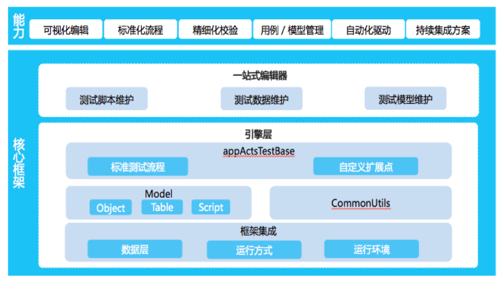
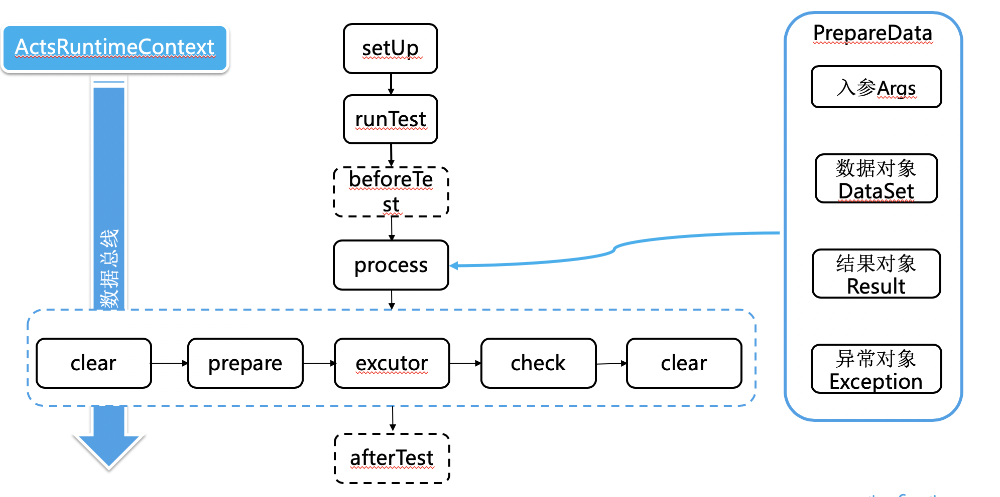

# 产品介绍

## 产品描述
ACTS（AntCoreTest）源于蚂蚁金服多年金融级分布式架构工程的测试实践的积累与沉淀，是一款白盒测试框架，旨在为企业提供高效、精细化的接口自动化测试。
与现有的诸如 TestNG 等开源框架相比，ACTS 除了具备通用的数据自动化驱动等测试能力外，还具有契合快速的互联网发展和复杂的分布式金融系统特点的模型驱动、可视化编辑和标准流程引擎等新特性，可辅助工程师高效、高质量地完成接口测试用例编写以及标准化精准化测试验证。

ACTS 是基于数据模型驱动测试引擎执行的的新一代测试框架（如图1所示），适配 TestNg+Spring 的测试上下文环境，以 YAML 为数据载体并在此上构建数据模型驱动，实现了一站式编辑、精细化校验和高效用例管理等，可以有效提高测试效率。

图1

## 运行原理

图2

1. 测试脚本启动的时，ActsDataProvider 会启动被测方法（被 @Test 注解的方法），加载对应的用例数据文件(以 YAML 文件承载)，然后转换成对应的 PrepareData 对象；
2. runTest 开始执行时会传入 PrepareData 和用例名称，ACTS 根据这些信息组装出 ActsRuntimeContext 上下文并在整个过程中传递，同时初始化 TestUnitHandler 测试处理器。runTest -> process 方法执行期包含如下四个子流程：

    | 说明 | 方法 |
    | :--- | :--- |
    | 清理 | clear(actsRuntimeContext) |
    | 准备 | prepare(actsRuntimeContext) |
    | 执行 | execute(actsRuntimeContext) |
    | 检查 | check(actsRuntimeContext) |

方法功能说明：
+ 清理阶段：清理准备数据、校验数据，防止脏数据对测试脚本产生影响；
+ 准备阶段：准备 DB 数据等；
+ 执行阶段：调用被测方法，捕获返回结果和异常等信息；
+ 检查阶段：根据测试数据，校验返回结果、DB 数据和异常信息等内容。

## 功能描述
ACTS 提供了以下能力：
### 2.1 一站式编辑
框架实现了测试数据与测试代码的分离，同时配套提供可视化编辑器 ACTS IDE，通过 ACTS IDE 可以快速地录入、查看和管理用例数据，有效减少重复性编码。
### 2.2 精细化校验
为了提高返回结果、DB 数据等期望数据的填写效率和减少检验点遗漏，框架提供了预跑返填功能；同时在 ACTS 校验规则标签的标记下，实现期望 DB 数据、期望结果等数据的精细化校验。
### 2.3 灵活可扩展
ACTS 提供了丰富的 API ，其封装于 ActsRuntimeContext 类中，借助 API 可快速获取和设置自定义参数、用例入参、期望结果等，满足用户对用例数据的自定义操作； 

同时，框架的 ActsTestBase 测试基类对外暴露各个执行阶段方法，包括 prepare，execute，check，clear 等，例如在测试类中通过重写 process 方法可将整个测试脚本重新编排。
### 2.4 统一配置能力
配置文件中提供丰富的配置能力以定制化框架的个性需求。

## 应用场景
基于 SOFABoot 搭建的应用，在 Intellij IDEA 开发环境下快速编写和执行接口测试用例。推荐使用 Intellij IDEA 2017 以便能更好地兼容 ACTS IDE。