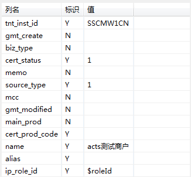
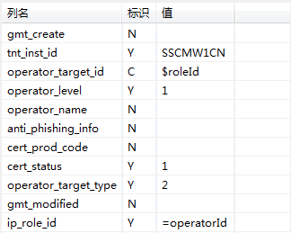
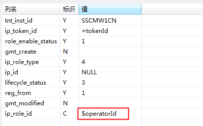
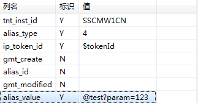

# 扩展功能
## 自定义引擎各个阶段

可以在测试脚本中或者基类中重写ActsTestBase提供的API。

(1)重写prepare，execute，check，clear等。可以通过在super.prepare()之前或者之后进行某些操作。

(2)重写process方法，在super.process()之前或之后进行操作。可将整个脚本重新编排，例如在现有的清理 --> 准备 --> 执行 --> 校验流程中增加一些个性化的步骤。

(3)重写beforeActsTest、afterActsTest，可以在每一个用例运行前后做一些个性化的操作，如准备上下文、缓存刷新等。

## 参数化

在结果期望和数据期望里面可以使用“$变量名”来标识某个值是变量，测试脚本中可以把值设置进去；
支持范围：入参、返回结果、数据库表字段，支持类型：目前仅支持String的参数化。

使用方法：

1、界面以$开头定义变量：


<div data-type="alignment" data-value="center" style="text-align:center">
  <div data-type="p">图60</div>
</div>

注：添加在自定义参数的参数，也可以直接在上述支持的地方引用

2、代码中给变量赋值：

```
@Override
public void beforeActsTest(ActsRuntimeContext actsRuntimeContext) {
 actsRuntimeContext.paramMap.put("roleId", "123");
 actsRuntimeContext.refreshDataParam();
}
```

在写DB数据期望的时候，也可以通过"="符号来进行赋值，表示这个值来自于查询结果。


<div data-type="alignment" data-value="center" style="text-align:center">
  <div data-type="p">图61</div>
</div>


后面的表就可以使用这个变量作为值。


<div data-type="alignment" data-value="center" style="text-align:center">
  <div data-type="p">图62</div>
</div>


假设接口会向2张表插数据

| id_A | value_A |
| :--- | :--- |
| 123 | abc |


| id_B | value_B |
| :--- | :--- |
| abc | efg |


查询的时候要先通过接口返回的A表的id_A 查到 value_A, 然后把value_A作为 B表的查询条件，在插件上面可以这样写：

| 字段 | flag | 值 |
| :--- | :--- | :--- |
| id_A | C | $param1 |
| value_A | Y | =param2 |


| 字段 | flag | 值 |
| :--- | :--- | :--- |
| id_B | C | $param2 |
| value_B | Y | efg |

上面操作说明：

1）=param2和\$param2的操作，表示框架会先从A表查出value_A 然后 select from 表B where id_B = value_A，进而得到全部B表的属性值

2）$param1表示可以在代码中对id\_A赋值，代码形如：
```
actsRuntimeContext.paramMap.put("param1","123");
```
表示对变量param1赋值123，上述代码可以写到脚本的beforeActsTest里面，这样在查询A表之前，框架就会将123赋值给id\_A

## 参数组件化

__目前仅支持String的组件化__

如果属性是需要动态生成的字符串，例如某些ID，可以通过“@”符号来调用一个组件生成这个属性，组件要放在跟test同级的component包下，即：com.corpname.appname.acts.component (这里appname是系统名，corpname是公司名，如alipay)。
```
public class MyComponent {
    @TestComponent(id = "test")
    public String test(String param) {
        return param+"123";
    }
}
```

<br/>并通过acts-config.properties配置指明参数化组件使其生效，多个组件使用英文逗号","分隔，末尾注意不必要的空格。
```
param_components = IdGenerateComponent,NoGenerateComponent
```


<div data-type="alignment" data-value="center" style="text-align:center">
  <div data-type="p">图63</div>
</div>

如果属性值为：@test?param=xxxx,就会自动替换为xxxx，组件的ID要保证唯一,否则默认调用第一个，如果声明了一个无参组件方法，调用方式为@test即可，新版本插件中支持组件化参数通过变量传入：@test?param=$id，实际执行时会替换id的值为实际值
脚本中也可以通过代码调用:
```
ActsComponentUtil.run("@test?param=123");
```
自定义组件多个参数的场景使用&分割参数：@test?param1=xxx&param2=yyy

## DB工具类

### 1.指定数据源进行DB表访问

框架ActsDBUtils方法中提供了DB的指定数据源访问，用于个性化DB操作。例如某张表的某条纪录不是准备数据也不是校验数据，但是需要在运行后删掉或更新，此时就需要用到该工具操作DB数据。

__使用前配置__

使用指定数据源方式需要在acts-config.properties文件中首先将要指定的数据源进行配置，配置例子如下：

```
datasource_bean_name_exampleDataSource=com.alipay.example.dal;exampleDataSource

整体配置的格式为：datasource_bean_name_XXXX(数据源名字)=XXX(数据源所在的bundle);XXXX(数据源名字)
```

__指定数据源方法__

ActsDBUtils工具类中指定数据源方法说明：

```
public static int getUpdateResultMap(String sql,String tableName,String dbConfigKey);

该方法用于指定数据源进行表的增，删，改的操作。sql为标准sql语句，tableName为逻辑表名，dbConfigKey为该
表所在的逻辑数据源配置，与acts-config.properties配置的XXXX(数据源名字)相同。

public static List<Map<String, Object>> getQueryResultMap(String sql, String tableName,String dbConfigKey);

该方法用于指定数据源进行表的查询操作，以上两个方法都是原子化的DB表的操作，如果有其他的DB需求可以在上面进行
封装。
```

### 2.不指定数据源进行DB表访问

该方式下ACTS框架默认根据表名搜索数据源，工具方法的使用步骤如下：

__使用前配置__
```
datasource_bundle_name=com.alipay.example.common.dal
ds_exampleDataSource= table1,tabal2

整体配置的格式为：
datasource_bundle_name=数据源所在模块名
ds_数据源名字=该数据源下的逻辑表名
```

__不指定数据源方法__
```
public static int getUpdateResultMap(String sql, String tableName);

该方法用于指定数据源进行表的增，删，改的操作。sql为标准sql语句，tableName为逻辑表名

public static List<Map<String, Object>> getQueryResultMap(String sql, String tableName);

该方法用于指定数据源进行表的查询操作

```

## ACTS各阶段注解扩展

被打上注解的自定义方法，可以在注解标示的不同阶段扩展个性化操作。

```
@BeforeClean
public void beforeClean(ActsRuntimeContext actsRuntimeContext) {
    System.out.println("数据清理前执行!!");
}

@AfterClean
public void afterClean(ActsRuntimeContext actsRuntimeContext) {
    System.out.println("数据清理后执行!!");
}

@BeforePrepare
public void beforePrepare(ActsRuntimeContext actsRuntimeContext) {
    System.out.println("数据准备前执行!!");
}

@AfterPrepare
public void afterPrepare(ActsRuntimeContext actsRuntimeContext) {
    System.out.println("数据准备后执行!!");
}

@BeforeCheck
public void beforeCheck(ActsRuntimeContext actsRuntimeContext) {
    System.out.println("数据check前执行!!");
}

@AfterCheck
public void afterCheck(ActsRuntimeContext actsRuntimeContext) {
    System.out.println("数据check之后执行!!");
}

```

使用中只需要在想要执行的方法上打上如上标签即可，被注解方法的参数需要符合上述示例中的参数，框架会自动传递ActsRuntimeContext供注解方法使用。
