# 一站式编辑

## 打开 ACTS IDE

在 Package 视图下，右键含 @Test 注解的函数名，ACTS 功能 -> 修改测试用例，如下图：

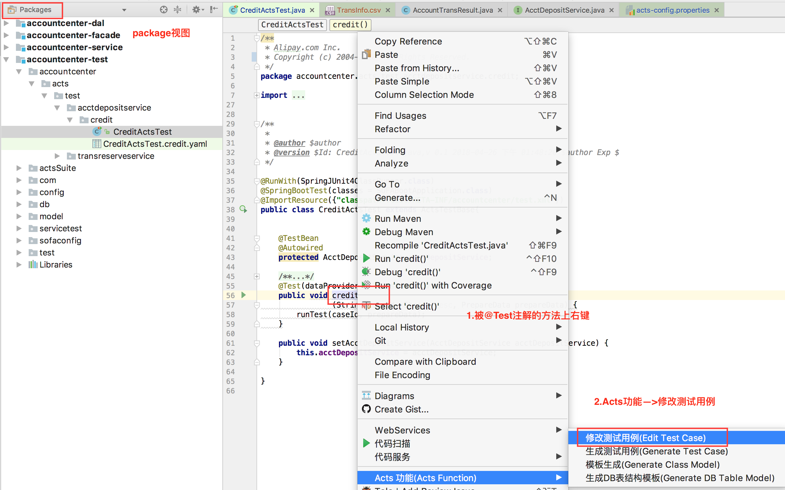
<p align="center">图24</p>

## 编写测试数据
## 准备入参
根据被测的接口方法的入参（类型、顺序、数量）正确准备入参数据，简单类型包括 String、Date、Integer、Float、Double、Long、Short、Byte（包含其对应的基本类型，即 int、float 等）；复杂类型为 List、Map、Set、自定义类、Java 定义的类以及前面五者的嵌套等。
### 简单入参
入参设置上右键 -> 模版选择 -> 简单入参选择：


<p align="center">图25</p>

导入简单入参后，值直接在这里填写；
自上而下表示被测接口方法的第1个、第2个和第3个参数，右键可以调节顺序。

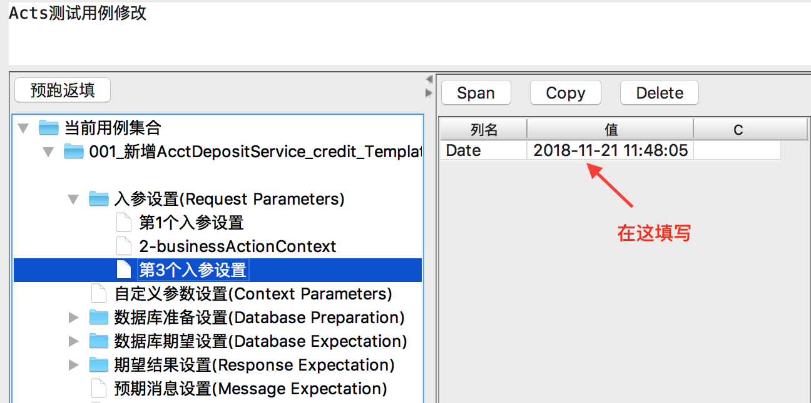
<p align="center">图26</p>

### 复杂入参

如图27所示，AccountTransRequest 和 BusinessActionContext 类需要生成入参模板，一般情况下，在一键生成测试脚本时会自动生成方法的入参和返回结果的类模板，打开 ACTS IDE 可对其进行编辑，如图28。

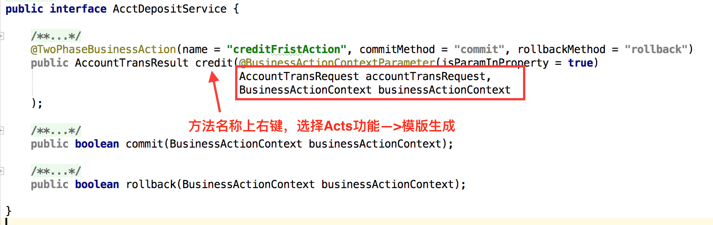
<p align="center">图27</p>

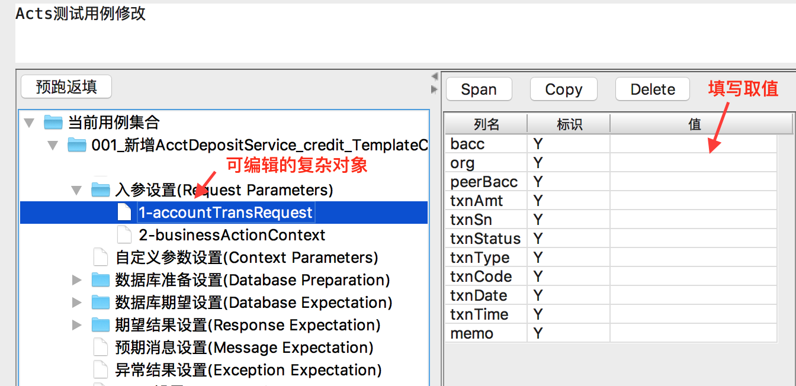
<p align="center">图28</p>

如果生成测试脚本时没有识别出方法的入参和返回结果模版，可先生成复杂入参和结果模版（具体操作参考[对象模型生成](./Usage-Model#对象模型生成)），然后打开 ACTS IDE 编辑器，在入参设置上右键 -> 模版选择 -> 复杂类型，添加后可以看到复杂对象，直接进行编辑。

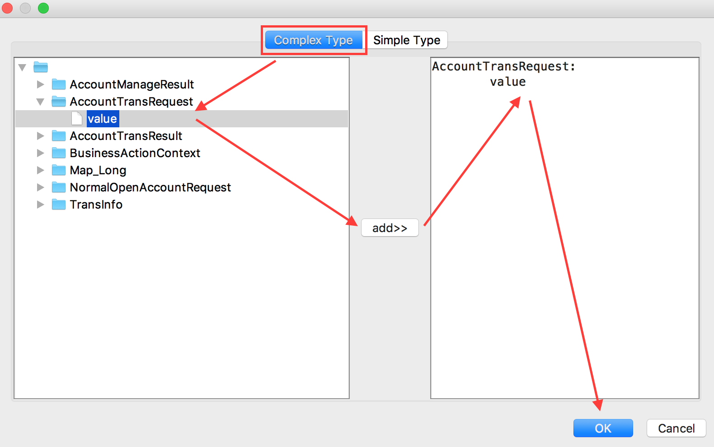
<p align="center">图29</p>

### list

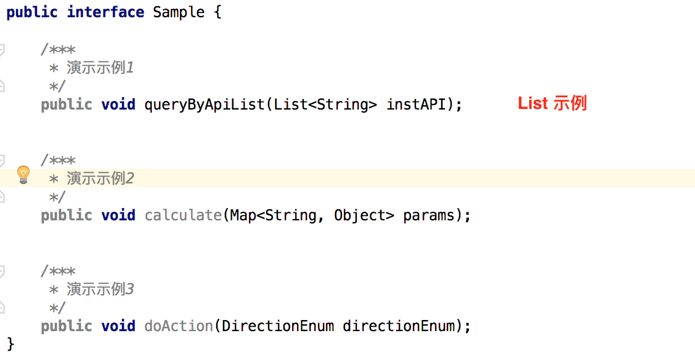
<p align="center">图30</p>

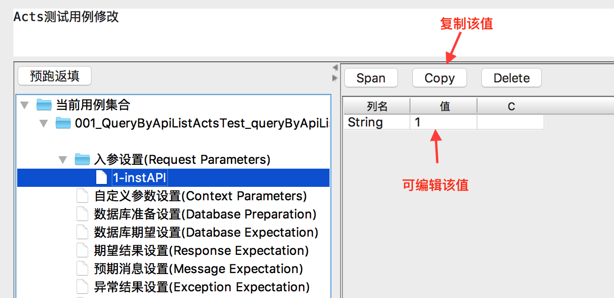
<p align="center">图31</p>

### map
以示例2为例（Set 与此类似）
图32中，演示示例2的方法入参为 Map<String, Object> 类型。由于 Object 不是具体类型，如果要设置 Object 为复杂对象，则需要去编辑 YAML。例如设置 Object 为 AccountTransResult 类型，则按照如下编辑：

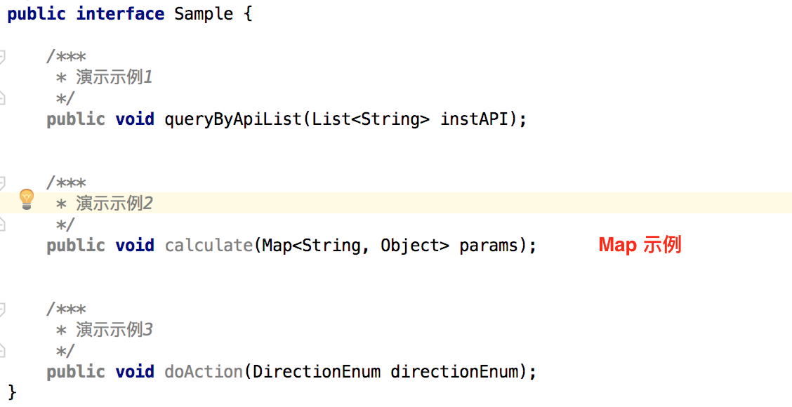
<p align="center">图32</p>

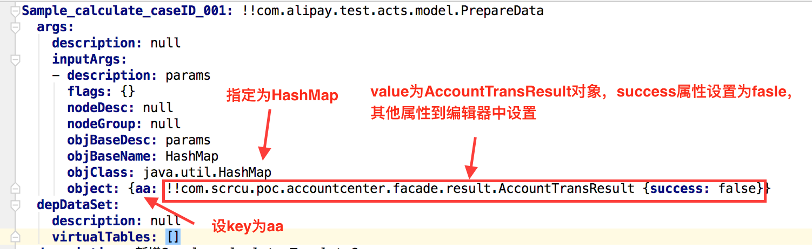
<p align="center">图33</p>

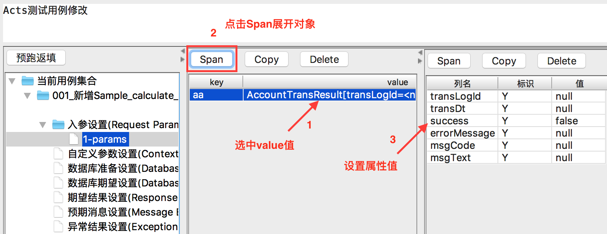
<p align="center">图34</p>

### enum
代码样例：

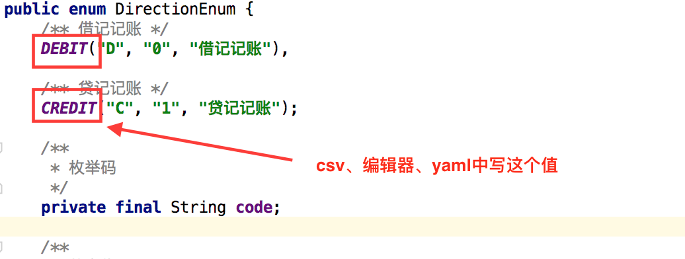
<p align="center">图35</p>

1.在 ACTS IDE 中编辑如下：

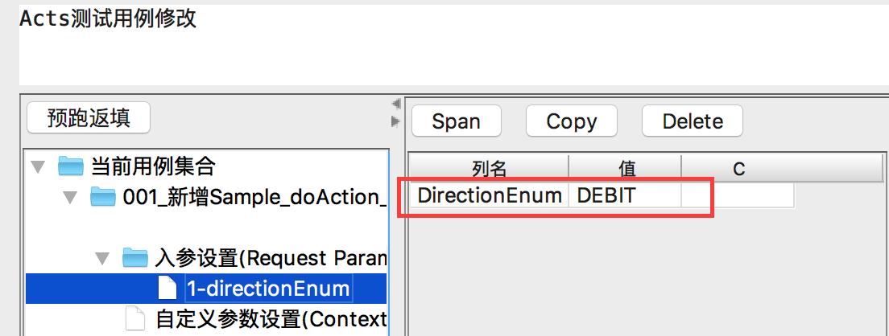
<p align="center">图36</p>

2.如果枚举嵌套在其他类中，则在该类的 CSV 模版中设置枚举的值为 DEBIT；

3.用例数据 YAML 中，如图37：
```yaml
interestRecoverTypeEnum: !!com.alipay.fc.loancore.common.util.enums.InterestRecoverTypeEnum 'ALL'
```

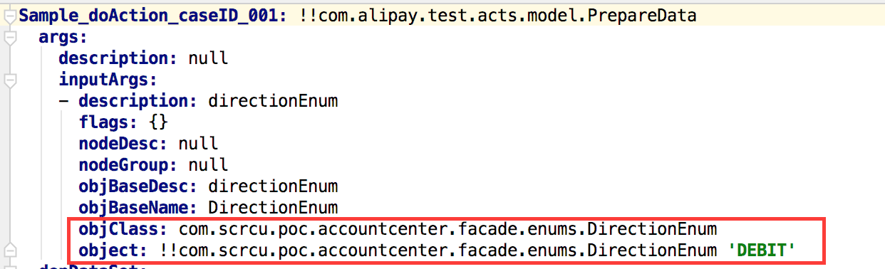
<p align="center">图37</p>

### 编码方式准备入参
覆盖 prepare 方法，通过 ActsRuntimeContext 的方法，快速获取和设置用例入参，如图38所示：

1. 获取所有入参：`List getInputParams()`
2. 按位置获取：`Object getInputParamByPos(int i)`
3. 新增用例参数：`void addInputParam(Object obj)`


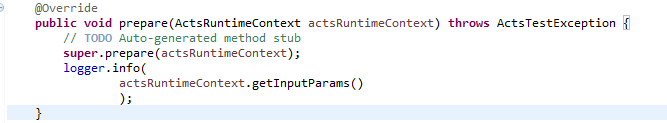
<div data-type="alignment" data-value="center" style="text-align:center">
  <div data-type="p">图38</div>
</div>

## 准备 DB 数据

### 准备 DB 数据-单列场景
如图39，在数据库准备设置位置右键，选择好要插入的 DB 模板（请先确保该DB模板已经生成），图中1、2、3步骤之后点击 OK 即插入 DB 准备模板，如图41，可对要插入 DB 的数据进行编辑：

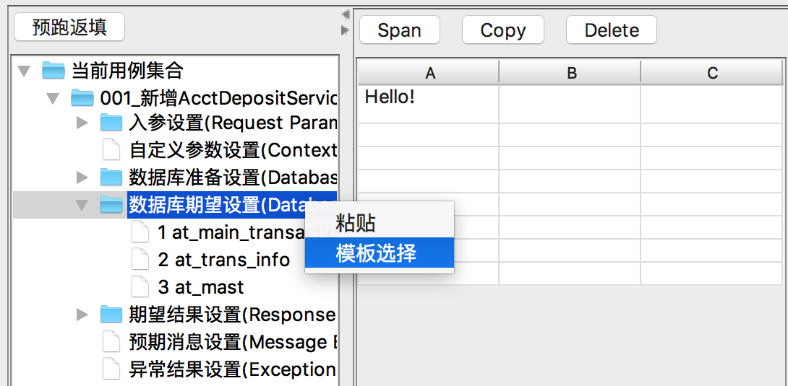
<p align="center">图39</p>

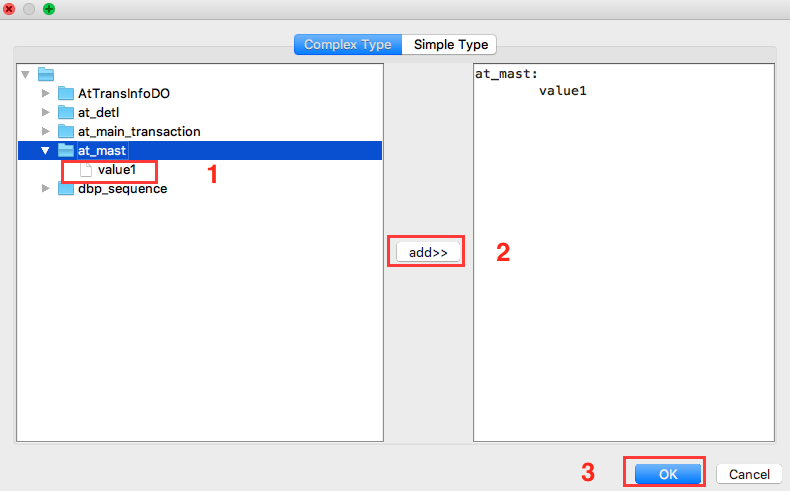
<p align="center">图40</p>

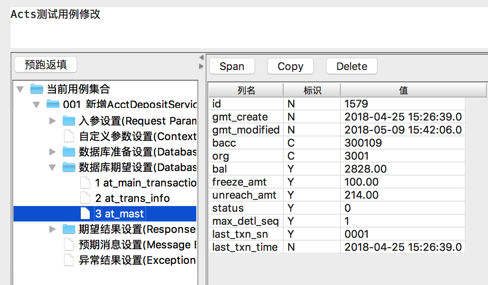
<p align="center">图41</p>

### 准备 DB 数据-多列场景
选中一列数据，点击复制，按此方法可复制多列数据，然后进行编辑即可：

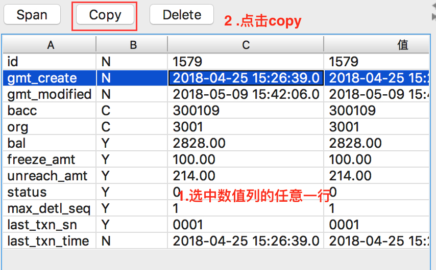
<p align="center">图42</p>

### 准备 DB 数据-flag说明
数据依赖标记：
```
Y: 插入
N：不插入
C：以此为where条件对插入后的数据进行清理
F：数据库函数
L: 大字段换行准备，准备方式为A=B;C=D
```

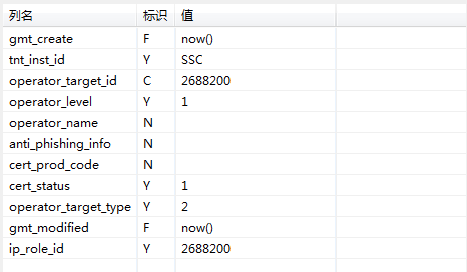
<p align="center">图43</p>

## 准备期望结果数据

生成期望结果的对象模型后，在 ACTS IDE 界面中，期望结果设置右键 -> 模版选择，见下图。

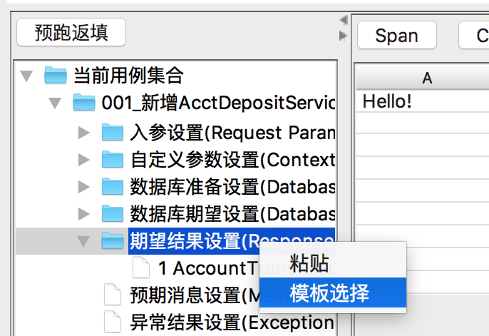
<p align="center">图44</p>

### 期望结果的 flag 说明
```
Y: 校验
N：不校验
D：时间偏移值比较，如 D200
ME：map 默认全 key 校验，ME则以期望 key 为准，实际值多余期望值的 key 不予校验
```

对于返回结果的时间 Date 类型字段校验说明：
1. Y | null -> 代表期望为 null
2. Y | 2015-01-01 00:00:00 -> 代表期望为 2015-01-01 00:00:00
3. N | null -> 代表不校验
4. D200 | 2015-01-01 00:00:00/null -> 代表与 2015-01-01 00:00:00/new Date() 相差 200 秒

### 编码方式准备期望结果
覆盖 prepare 方法，通过 ActsRuntimeContext 的如下方法，快速获取和设置期望结果。
1. 获取期望结果：`Object getExpectResult()`
2. 设置期望结果：`Boolean setExpectResult(Object objToSet)`

## 准备期望 DB 数据
### 准备期望 DB 数据-单列场景
在数据库期望设置里配置，操作参考[准备 DB 数据-单列场景](#准备-DB-数据-单列场景)
### 准备期望 DB 数据-多列场景
在数据库期望设置里配置，操作参考[准备 DB 数据-多列场景](#准备-DB-数据-多列场景)

### 期望 DB 数据的 flag 说明
数据校验标记：
```plain
Y: 校验
N：不校验
C：以此为条件 select 然后比较，如果结果有多个，则返回的结果所有记录都要和当前需要校验的数据进行校验
CN： 这个 flag 表示当前这张表中以 C 和 CN 为条件查询出的结果为空
D200：表示对比时间的时候误差 200s 之内都算通过，日期类型的格式为：today
L： 数据库大字段换行数据校验，准备方式为 A=B;C=D
P：DB 大字段校验，以期望结果的 kv 为基准，对 DB 大字段里的 kv 进行校验，要求 DB 里的 kv 之间是换行分隔
R：正则匹配校验
```

## 准备期望异常数据
### 编码方式准备期望异常数据
部分系统封装的异常类没有默认构造函数，这样通过模版添加的异常结果在加载 YAML 时会有问题（无默认构造函数无法构造当前类），需要通过代码方式，结合自定义参数编写异常脚本，如下图：

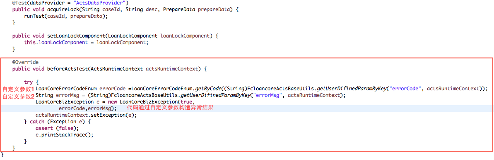
<p align="center">图45</p>

## 准备自定义数据
### 自定义数据-用途
用户自定义的各类型数据，用于测试过程中自由使用
### 自定义数据-数据类型
数据类型可参考 [入参](#准备入参) 部分
### 编码方式准备自定义数据
快速获取和设置自定义参数：

1. 获取全部自定义参数：`getParamMap getParamMap()`
2. 按 key 获取：`Object getParamByName(String paraName)`
3. 新增自定义参数：`void addOneParam(String paraName, Object paraObj)`
4. 替换自定义参数：`void setParamMap(Map<String, Object> paramMap)`
5. 以范型方式获取自定义参数：`T getParamByNameWithGeneric(String paraName)`


## 不同数据类型编辑方式
### 简单类型编辑
以自定义参数设置添加简单类型数据为例。如图46，自定义参数设置右键 -> 模板选择，弹框填写入参名字：

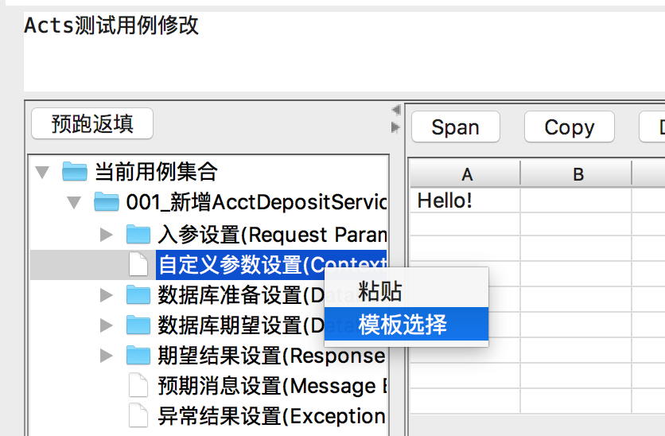
<p align="center">图46</p>

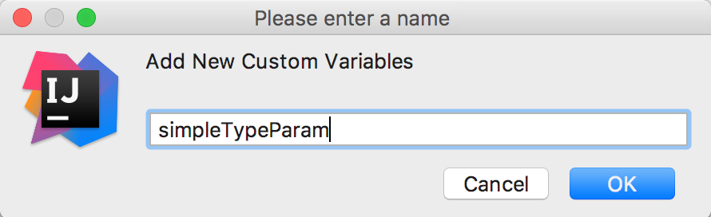
<p align="center">图47</p>

选择 String 类型，在下方编辑框填写值即可，生成后也可自行编辑：

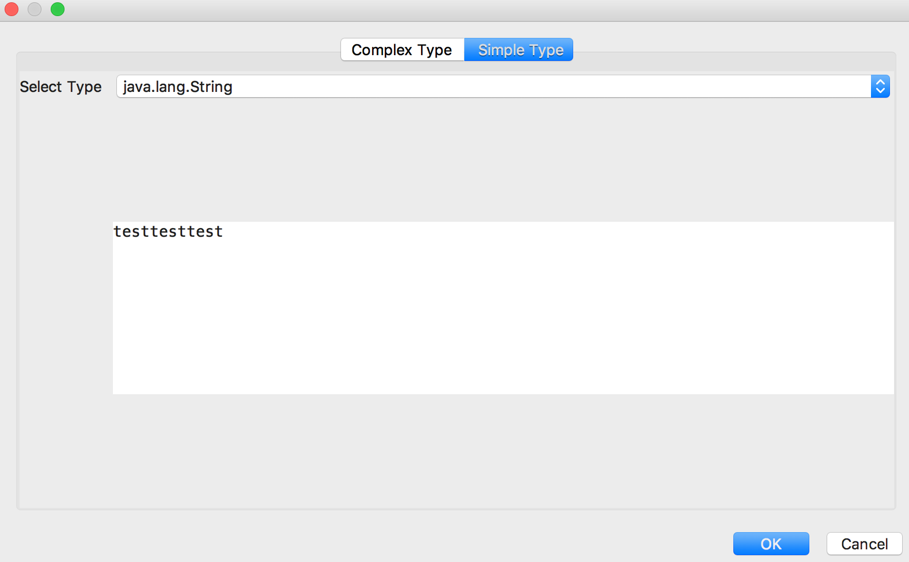
<p align="center">图48</p>

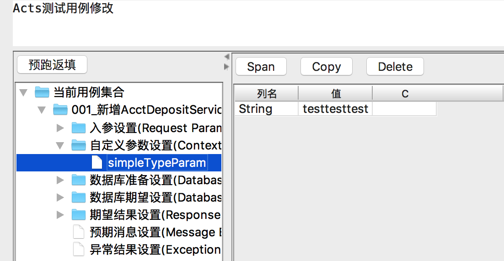
<p align="center">图49</p>

### 复杂对象编辑
以自定义参数设置添加复杂对象数据为例

参照[简单类型编辑](#简单类型编辑)，在弹框填写好入参名字。然后在模板选择列表中（如果找不到想要的复杂对象，请先生成相应的数据模板），选择一个复杂对象，然后 add，点击 OK 确认。

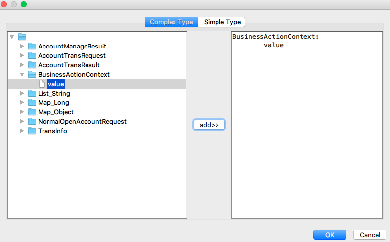
<p align="center">图50</p>


如果该复杂对象中还包含复杂对象，选中该行，点击展开（如果没反应，尝试光标定位 value 列，然后点击展开），则数据会展开至当前右边的编辑区。如果还有复杂对象，可做类似操作继续进行展开。

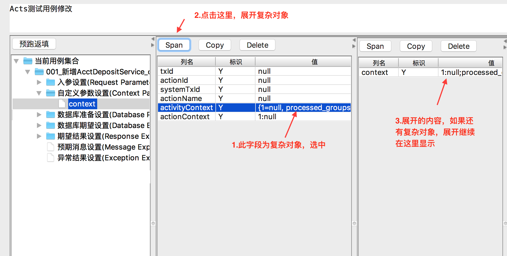
<p align="center">图51</p>

### list 编辑
以自定义参数设置添加 `List<String>` 为例，模板选择 list 模板：

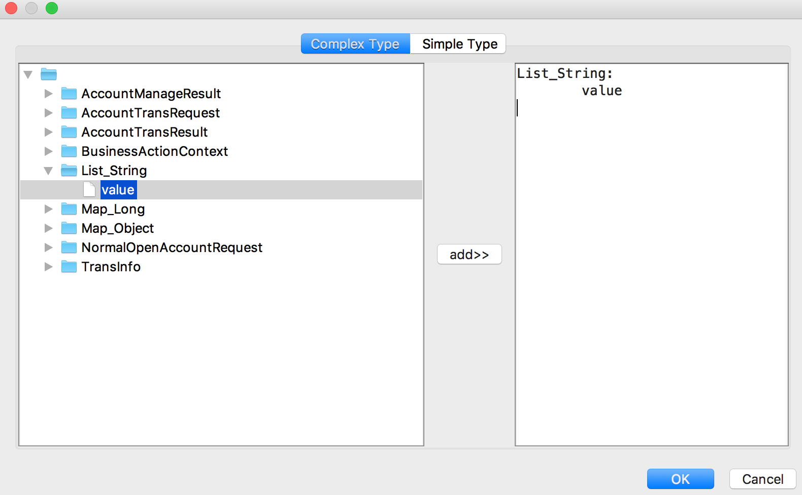
<p align="center">图52</p>

自行编辑，然后可选中第一列进行复制，如图53：

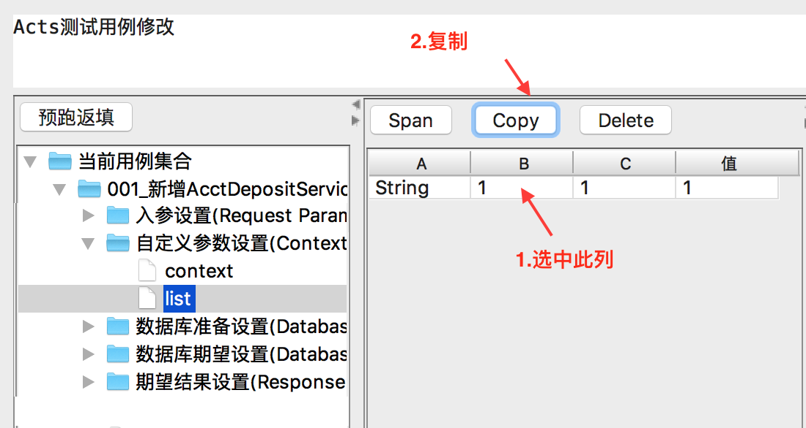
<p align="center">图53</p>

### map 编辑
可参照入参中有关 [map](#map) 部分。

### enum 编辑
可参照入参中有关 [enum](#enum) 部分。

## 右键功能说明
### 复制当前节点

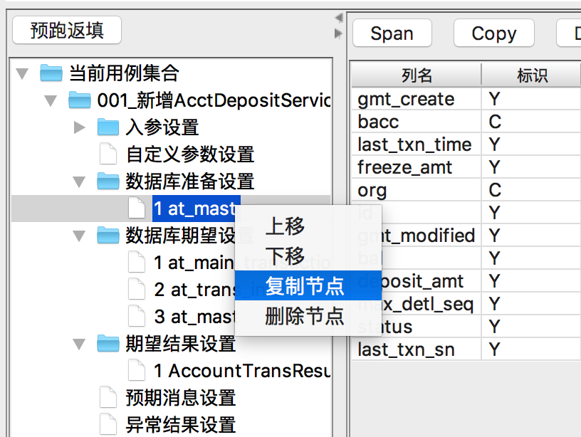
<p align="center">图54</p>

### 删除当前节点

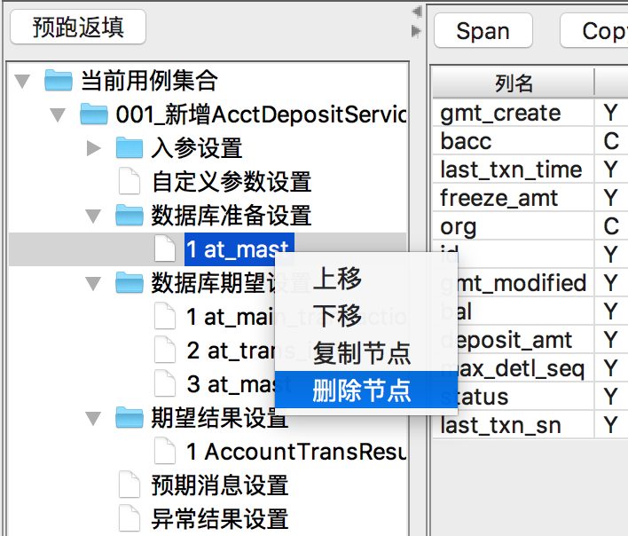
<p align="center">图55</p>

## 修改用例名称
在用例名上右键，修改用例名称：


<p align="center">图56</p>

## 复制用例
在用例名上右键，复制当前用例：

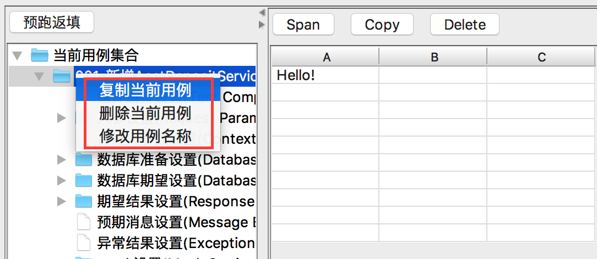
<p align="center">图57</p>

## 预跑返填
为了提高期望数据值（返回结果和 DB 数据）的快速填写，框架提供了预跑返填功能，一个用例准备好入参、准备数据等，用例执行的基本数据后，可先不必填写期望数据，用例运行起来后，框架可自动捕捉返回结果、DB 变更数据等，运行后打开编辑器点击 __预跑返填__，可填充指定用例的期望数据。具体使用案例：
前置条件：[配置 ACTS 日志](./Configuration-Log.md)

1. `acts-config.properties` 配置文件中开关设置：`collect_case_result=true`；
2. 正常执行 ACTS 用例；
3. 通过插件反填结果，需要选中要操作的那一行


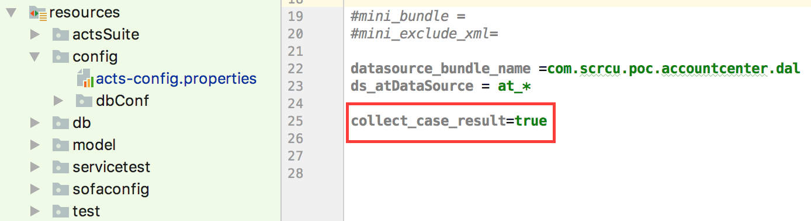
<p align="center">图58</p>

这一步只是框架提供的便捷特性，在预跑结果反填之后请严格测试每一条数据的正确性，避免代码缺陷产生遗漏。

### 一键返填

如图59，选中需要反填的用例，确认即可。

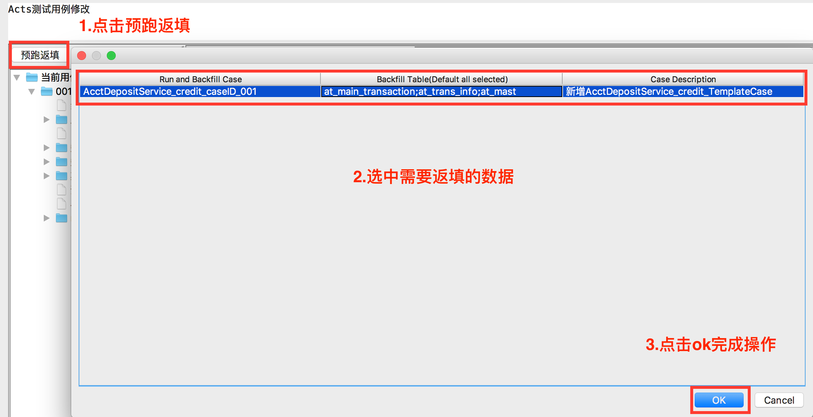
<p align="center">图59</p>
