# 一键模型化

## 快速理解 ACTS 的模型
在写测试用例的过程中，需要预先准备一些 DB 表、方法入参的数据，或者需要校验一些 DB 表、返回结果的数据，这些数据可以以模版的形式保存下来，在编辑用例时，可以方便的导入这些数据到准备数据或者校验数据，实现数据复用。目前 ACTS 模型可以分为 DB 模型和类模型。

常规的测试用例编写，DB 、方法入参、返回结果等领域模型的数据准备是通过测试代码组织的，随着业务复杂度，领域模型复杂度也在不断增加，尤其在金融级业务用，往往一个类或者数据表有数十个属性或者字段，类与类的嵌套也是随处可见，代码构造复杂对象变得十分困难且容易疏漏，问题频现：
* 表太多容易遗漏，排查时间太长；
* 表的字段名记不住，时不时写错；
* 接口入参数量多类型复杂，看见就头疼；
* 类的属性太多，容易遗漏重要属性；
* 嵌套构造对象，不断的 new 和 set 赋值；
* 继承和实现关系复杂，遗漏重要属性；

ACTS 的模版有可以有效应对上述问题，通过将类和表固化为 CSV，类的结构一目了然，通过类、数据表的模版可以快速的模版化地创建对象，并序列化到 YAML 文件中，使用 ACTS IDE 可以方便的管理用例数据。

### 模型存储位置

在 test 模块的 resource/model 目录可以查看已经存在的模型。
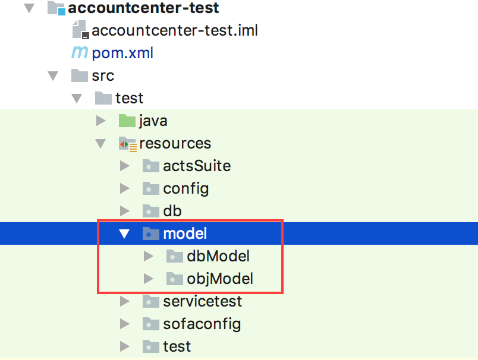
<p align="center">图4</p>

## 数据表模型生成

### 数据表模型样例

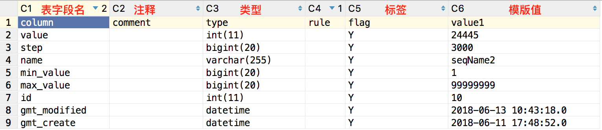
<p align="center">图5</p>

1. 校验 flag 说明
    ```plain
    Y: 插入
    N：不插入
    C：以此为 where 条件对插入后的数据进行清理
    F：数据库函数
    L: 大字段换行准备，准备方式为 A=B;C=D
    ```
2. 用例编辑使用模型快速导入数据

使用 ACTS IDE 编辑 DB 表数据（包括准备表数据、期望表数据）时，可右键新增指定表的模型，用于直接从表模型的 CSV 中导入表的全部字段和值，以便快速编辑。
DB 模版的使用可参考 [准备 DB 数据](./Usage-IDE#准备-DB-数据)。

### 生成表模型

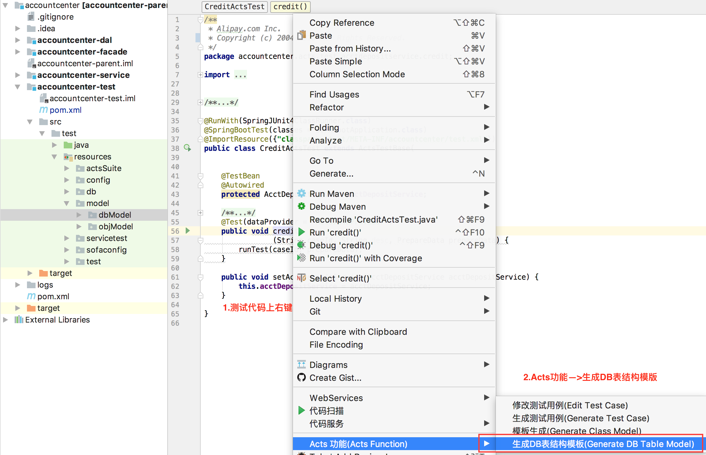
<p align="center">图6</p>


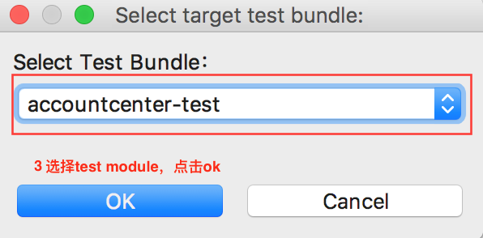
<p align="center">图7</p>


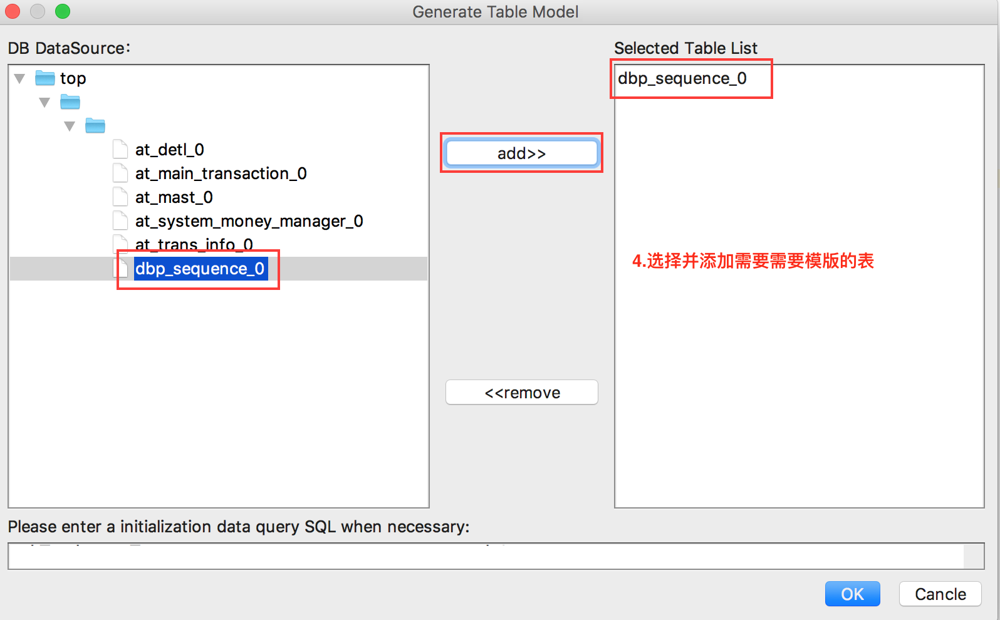
<p align="center">图8</p>

点击 OK 后生成模板，如图9：

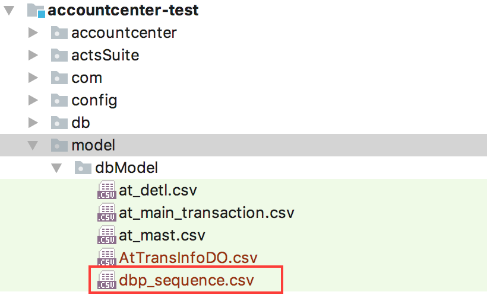
<p align="center">图9</p>


同时支持不配置直连获取表结构的方式生成表模型，即在 DO 类上右键根据类生成表模型：
DO 类上右击 -> ACTS 功能 -> 生成 DO 模型：

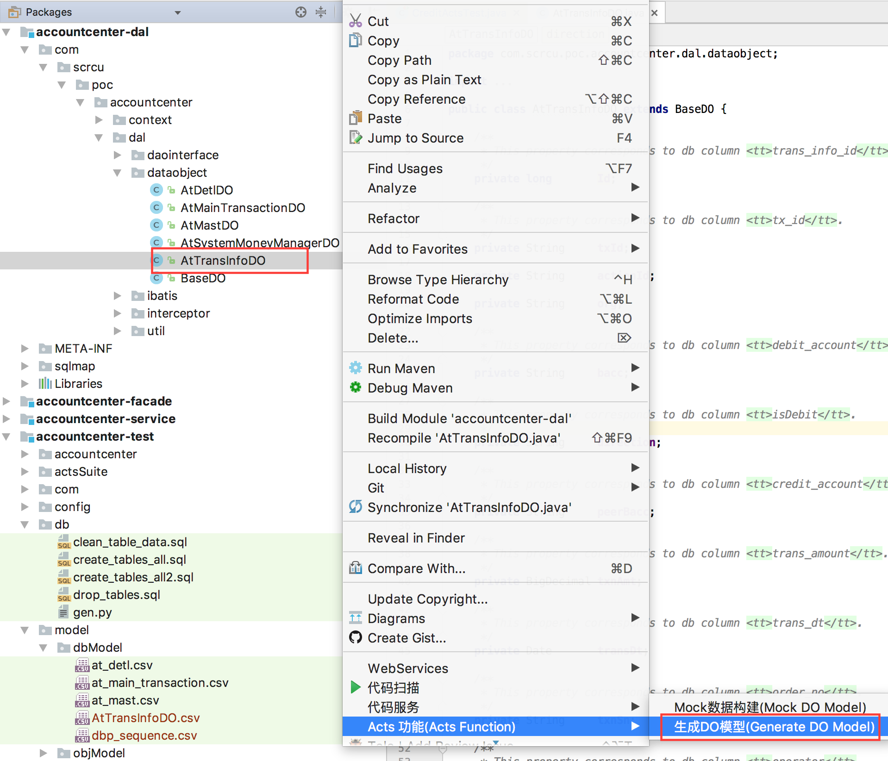
<p align="center">图10</p>


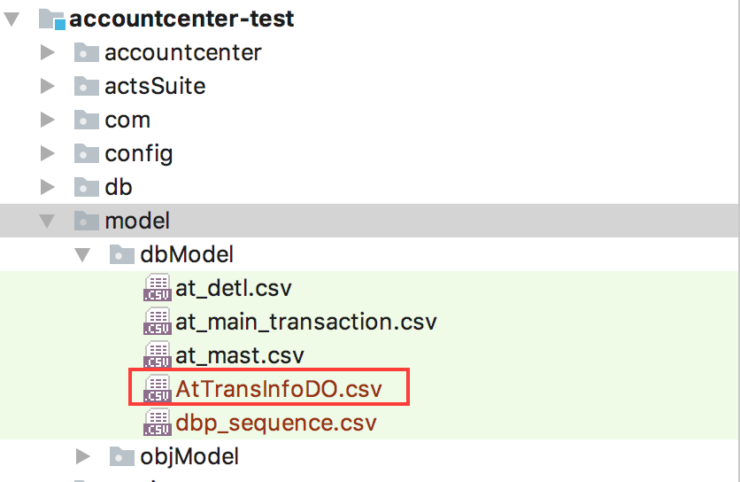
<p align="center">图11</p>

## 对象模型生成

### 对象模型样例

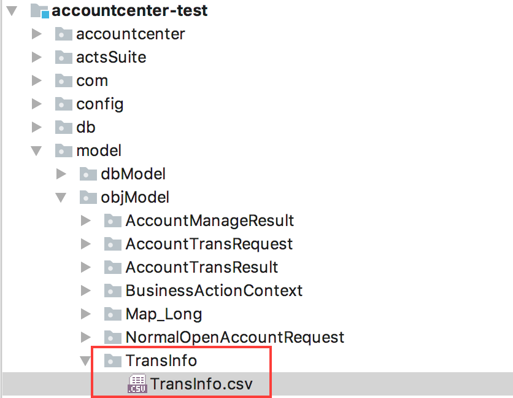
<p align="center">图12</p>

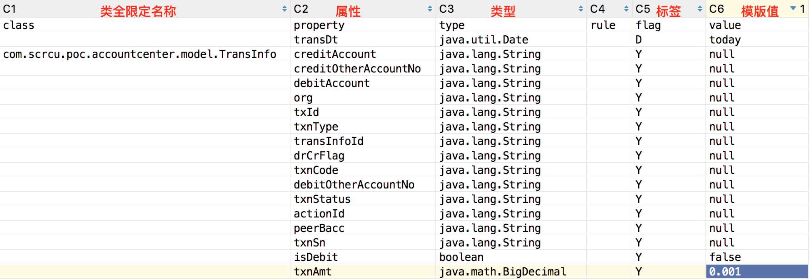
<p align="center">图13</p>

一个复杂对象是一个闭包，不但包含其自身模型还包含其嵌套对象的模型。

ACTS 使用模型快速导入数据、编辑复杂对象（包括入参、返回结果和异常等），在 ACTS IDE 中可右键选择类模型，用于构建该类的对象并赋值以便快速编辑。

### 生成方法
有两种方式：1.待构建模型的类定义的任意方法上点击；2.接口定义的方法上点击，详细操作看下图示例。

使用 IDEA 的同学请注意：请先确保代码已编译，IDEA 不会自动编译而需要手动 `mvn clean install` 或者打开自动编译 File -> Settings -> Build,Execution,Deployment -> Compiler -> Make project automatically。

#### ACTS IDE 生成对象模型
（1）待构建模型的类定义的任意方法上点击，生成当前类的模型


<p align="center">图14</p>

（2）接口定义任意方法上点击，生成当前接口中，所有方法的复杂入参、复杂返回结果的模型

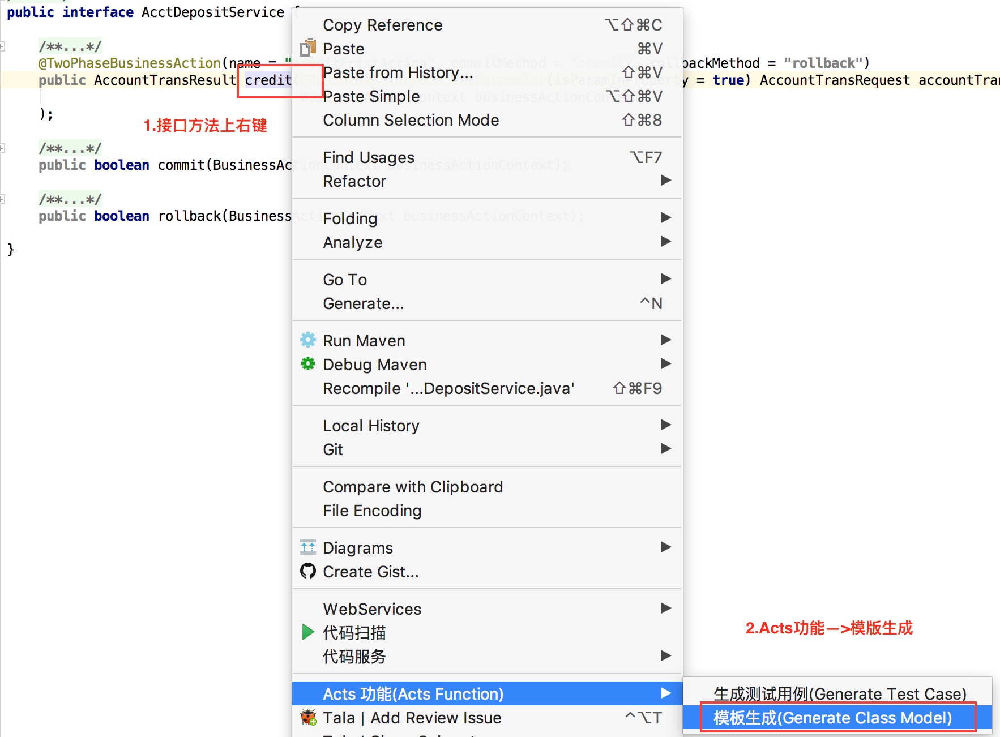
<p align="center">图15</p>
