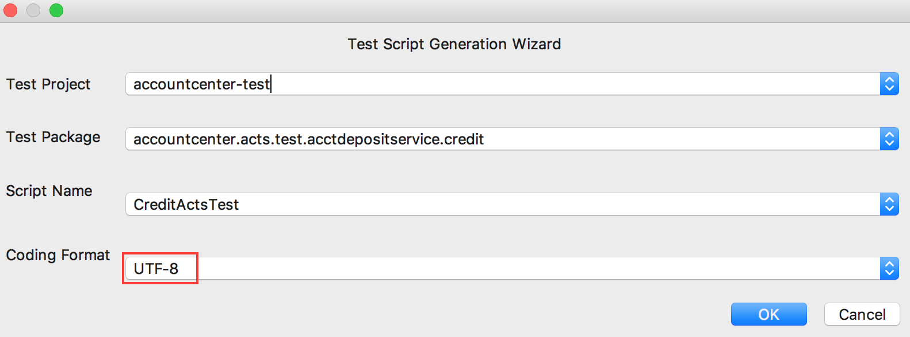
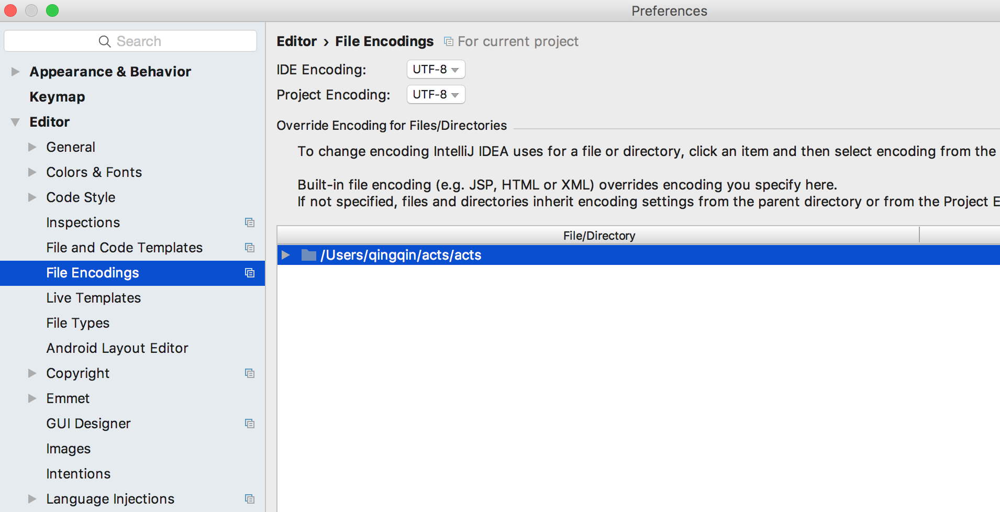
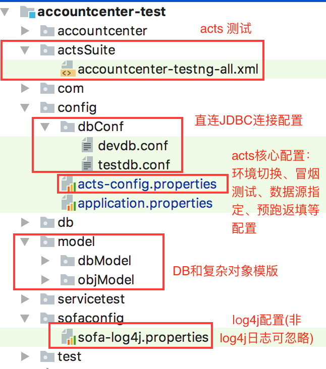

# 框架准备

在阅读前，您可以参考[快速开始](./GettingStarted)下载并安装 ACTS IDE 和引入 ACTS 依赖，
浏览[实践视频](https://antloop.github.io/)了解 ACTS 的配置和基本使用。

本部分主要包含编码说明、数据源配置和一键配置说明，以帮助您使用 ACTS 框架。

## 编码说明

请确保 ACTS 的编码与系统代码的编码一致，即确定以下的编码保持一致：生成脚本选择的编码、workspace 的编码应该都与应用代码编码保持一致，不一致时会出现乱码问题。

生成脚本选择的编码，如下图设置：


<p align="center">图1</p>

IDEA workspace 的编码：


<p align="center">图2</p>

## 数据源配置

ACTS 配置数据源的目的，是为了在数据准备、数据清理、数据校验阶段，能够使用系统的数据源正确的进行 DB 增删改查。
#### 数据源配置 

在 `src/test/resource/config/acts-config.properties` 中配置 dal 层的 ModuleName、数据源以及表的对应关系，以 ds_ 开头，如下：
```plain
datasource_bundle_name =com.alipay.testapp.common.dal
ds_bean1=table1,table2
ds_bean2=table3,table4

#配置格式
#ds_数据源bean=逻辑表名1,逻辑表名2
```
其中数据源 bean1、数据源 bean2 是应用代码中 dal 层的数据源 bean 的名称，支持多个数据源。表名支持正则表达式，无需带分库分表后缀，若有多个数据源时请注意，某张表只能属于一个数据源，如下图：


<p align="center">图3</p>

#### 数据库直连
数据库直连，用于 DB 数据模型的生成。在 `src/test/resource/config/dbConf/` 下的 devdb.conf 或 testdb.conf 中配置如下：
```plain
xxx_url = jdbc:oracle:thin:@localhost:1521:cifdb
xxx_username = myname
xxx_password = mypswd
```
    
## 一键配置的说明
一键配置测试框架主要生成包含两部分，一部分是基础 Java 类，另一类是必须的配置文件，具体生成内容如下：
#### Java 类
 + AppNameActsBaseUtils.java
 
    测试脚本编写过程中常用的从框架中获取各种数据的工具类，初始化搭建只提供了常用的方法，可自行添加。

 + AppNameActsTestBase.java
 
    封装后的应用测试基类，业务系统如有特殊需求可在其上自行封装，如果没有则可以忽略此文件。

#### 配置文件


<p align="center">图4</p>