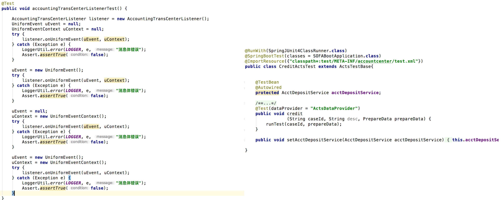
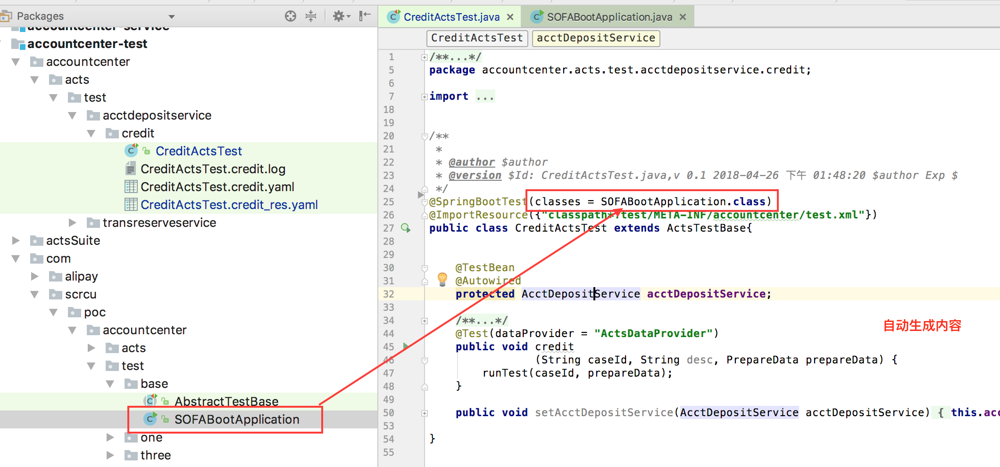
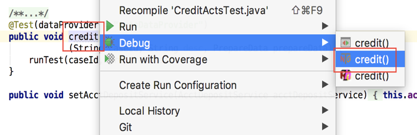
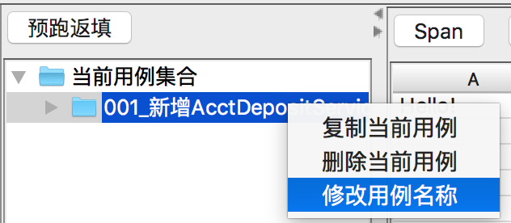
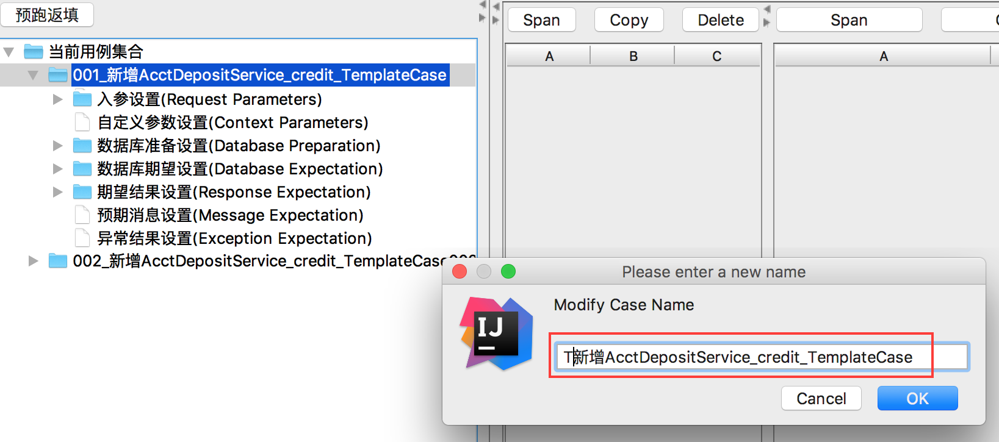
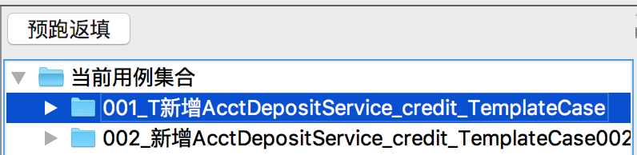

# 一键脚本化
## 快速理解 ACTS 中的脚本
如果你是一个经常编写测试用例的同学，是不是经常苦于这样的问题：
* 不断的 assertEquals 写得快吐了，重复性编码毫无创意；
* 少一个 assert 容易假绿，错一个败坏心情；
* 场景一旦复杂，测试代码比业务代码还要长，写起来痛不欲生；
* 每换一个应用，之前写的工具类就要搬一次；

左图为 TestNG 用例，右图为 ACTS 用例，重复性代码一去不回，代码体积明显缩小。区别于普通测试脚本，ACTS 脚本继承自 ActsTestBase 类，封装了数据加载、驱动、执行引擎和校验规则，无需用户来组织清理数据、准备数据、执行用例和校验结果，对于简单业务可以做到零编码，极大释放代码编写和后期维护成本。


<p align="center">图16</p>

## 测试脚本生成

前提条件：__务必 mvn 编译工程和生成对象模型，否则会造成 ACTS IDE 不可预料的错误，如无法编辑、数据不正确等__。

接口定义的方法上点击，选择 ACTS 功能 -> 生成测试用例。


<p align="center">图17</p>


<p align="center">图18</p>



<p align="center">图19</p>

## 测试脚本运行
方法：右键 ACTS 脚本中的被测方法，选择 TestNG 来执行测试脚本，如下图：


<p align="center">图20</p>

## 指定测试脚本运行

1. 在 `src/test/resource/config/acts-config.properties` 中配置 `test_only＝^T`，表示只跑用例名称以 `T` 开头的用例，`^T` 也可以换成其他正则表达式；

2. 修改要测试的用例名称，在用例名前面加 `T`，ACTS 运行时时仅执行用例名称以 `T` 开头的用例。


<p align="center">图21</p>



<div data-type="alignment" data-value="center" style="text-align:center">
  <div data-type="p">图22</div>
</div>



<div data-type="alignment" data-value="center" style="text-align:center">
  <div data-type="p">图23</div>
</div>


## 脚本用例拆分功能

默认每个测试脚本的所有用例数据保存在同一个 YAML 中，ACTS 支持用例数据根据开关 `spilt_yaml_by_case` 来决定同一测试脚本的所有用例数据存储在一个 YAML 中还是每个用例存储为一个 YAML。
开关默认为关闭，即同一测试脚本的所有测试数据存储在一个 YAML 文件中。

在 `acts-config.properities` 中设置 `spilt_yaml_by_case=true` 即可打开开关，之后新生成测试脚本时每个用例对应一个单独的以 caseId 命名的 YAML文件，拆分的方式可以降低多人研发同一接口带来的文件冲突问题。 

此外，为了支持将老的 YAML 文件按用例拆分，ACTS 提供了工具类，如下，支持将指定脚本下，指定路径的 YAML 文件按用例拆分。

   __BaseDataUtil.saveYamlDataToCaseByCase__

* 注意：拆分后，建议先给原有 YAML 重命名做备份，然后打开用例编辑器检查拆分后的文件内容是否正确，确认无误后可删除原有 YAML 文件，两者不能并存。

## 编码方式准备数据
ACTS 提供了数据自定义 API 接口，封装于 ActsRuntimeContext 类中，如下：
+ 快速获取和设置自定义参数
    
    获取全部自定义参数：`getParamMap getParamMap()` <br/>
    按 key 获取：`Object getParamByName(String paraName)` <br/>
    新增自定义参数：`void addOneParam(String paraName, Object paraObj)` <br/>
    替换自定义参数：`void setParamMap(Map<String, Object> paramMap)` <br/>
    泛型方式获取自定义参数：`T getParamByNameWithGeneric(String paraName)`

+ 快速获取和设置用例入参

    获取所有入参：`List getInputParams()` <br/>
    按位置获取：`Object getInputParamByPos(int i)` <br/>
    新增用例参数：`void addInputParam(Object obj)` 

+ 快速获取和设置期望结果

    获取期望结果：`Object getExpectResult()` <br/>
    设置期望结果：`Boolean setExpectResult(Object objToSet)`

## Mock 功能使用
Mock 功能目前是采用 Mockito 的方案，具体资料见 
[Mockito英文文档](https://static.javadoc.io/org.mockito/mockito-core/2.18.3/org/mockito/Mockito.html)和
[Mockito中文文档](https://github.com/hehonghui/mockito-doc-zh)
### 增加依赖
在 test 模块增加如下依赖（如果已经引入 SOFABoot 的测试 starter 则无需重复引入）
```xml
<dependency>
    <groupId>org.springframework.boot</groupId>
    <artifactId>spring-boot-starter-test</artifactId>
    <scope>test</scope>
</dependency>
```
默认 spring test 依赖的 mockito 版本是 1.x，想要升级的可以排除后再引入相应的版本
```xml
<dependency>
    <groupId>org.mockito</groupId>
    <artifactId>mockito-core</artifactId>
    <version>2.18.3</version>
</dependency>
```

__Mockito__ 用于测试时进行打桩处理，通过它可以指定某个类的某个方法在什么情况下返回什么样的值。Mockito 库能够 Mock 对象、验证结果以及打桩，示例如下：

```java
@SpringBootTest(classes = SOFABootApplication.class)
@TestExecutionListeners(listeners = MockitoTestExecutionListener.class)
public class RegisterUserActsTest extends ActsTestBase {

    @TestBean
    @Autowired
    // 这是测试类
    public UserService userService;

    @MockBean
    // 这是要mock的bean
    public AccountManageFacadeClient accountManageFacadeClient;

    @Test(dataProvider = "ActsDataProvider")
    public void registerUser
                (String caseId, String desc, PrepareData prepareData) {
        runTest(caseId, prepareData);
    }

    @Override
    public void beforeActsTest(ActsRuntimeContext actsRuntimeContext) {
        super.beforeActsTest(actsRuntimeContext);
        AccountManageResult accountManageResult = new AccountManageResult();
        accountManageResult.setAccountNo("testAccount");
        accountManageResult.setOperateDt(new Date());
        accountManageResult.setSuccess(true);
        Mockito.when(accountManageFacadeClient.openAccount(Mockito.any(NormalOpenAccountRequest.class))).thenReturn(accountManageResult);
    }

    public void setUserService(UserService userService) {
        this.userService = userService;
    }
}
```
