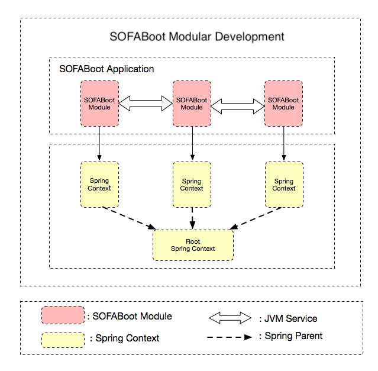

Since version 2.4.0, SOFABoot has started to support modular development capability based on Spring context isolation. To better understand the concept of modular development of SOFABoot, let's distinguish several common forms of modularization:

- Modularization based on code organization: This is the most common form. Codes with different functions are placed under different Java projects at development time and into different jar packages at compile time. At runtime, all Java classes are under the same classpath without any isolation;
- Modularization based on Spring context isolation: Use the Spring context to perform isolation of different function modules. At development and compile time, the codes and configurations are also placed under different Java projects. At runtime, however, different Spring Beans are invisible from each other, and IoC only occurs within the same context, but all the Java classes are still under the same ClassLoader;
- Modularization based on ClassLoader isolation: Borrow the ClassLoader to perform isolation. Each module has an independent ClassLoader, and the classpath between modules differs. [SOFAArk](https://github.com/sofastack/sofa-ark) is the practice of such modularization.

SOFABoot Modular Development belongs to the second modularization form--modularization based on Spring context isolation. Each SOFABoot module uses an independent Spring context to avoid BeanId conflicts between different SOFABoot modules and effectively reduces the cost of communication between teams during enterprise-level multi-module development.

** More details about SOFABoot module is introduced in the [article](https://www.sofastack.tech/posts/2018-07-25-01)**

## Feature Description

 

### Import Dependency
+ To use SOFABoot module, you should import the following dependency:
```xml
<dependency>
    <groupId>com.alipay.sofa</groupId>
    <artifactId>isle-sofa-boot-starter</artifactId>
</dependency>
```

### SOFABoot Module

SOFABoot framework has defined the concept of SOFABoot module: A SOFABoot module is a common Jar package including Java code, Spring configuration files, and SOFABoot module identifiers. A SOFABoot application can be comprised of multiple SOFABoot modules, each of which has independent Spring context.

The modular development with SOFABoot provides developers with the following features:

- At runtime, the Spring context of each SOFABoot module is isolated, so the defined Beans between modules will not affect each other;
- Each SOFABoot module is full-featured and self-contained, allowing for easy migration and reuse in different SOFABoot applications. Developers only need to copy the whole SOFABoot module to the application and adjust the Maven dependence before running it.

For the format definition of SOFABoot module, see: [Module Configuration](./SOFABoot-Module).

### Invocation between SOFABoot Modules

After isolation of context, the Bean between modules cannot be directly injected, so the SOFA service is required for invocation between the modules. Currently, SOFABoot offers two forms of service publish and reference, to resolve calls between modules of different levels:

- JVM service publish and reference: Resolve invocations between the SOFABoot modules within a SOFABoot application, [JVM Service Publish and Reference] (./Module-Service)
- RPC service publish and reference: Resolve invocations between multiple SOFABoot applications, [RPC Service Publish and Reference](https://github.com/sofastack/sofa-rpc/wiki/Publish-And-Reference).

### Module Parallel Start

Each SOFABoot has an independent Spring context, and multiple SOFABoot modules support parallel start. Compared with the single Spring context mode of Spring Boot, module parallelization can speed up the application startup.

### Root Application Context

When the SOFABoot application runs, it will generate a Spring Context. We call it Root Application Context, which is the Parent of the Spring Context created by each SOFABoot module. This design is to ensure that the Spring Context of each SOFABoot can find the Beans created in the Root Application Context. When a Starter is added to the application, the Beans added in the starter can be used not only by the Root Application Context but also the Spring Context of each SOFABoot module.
