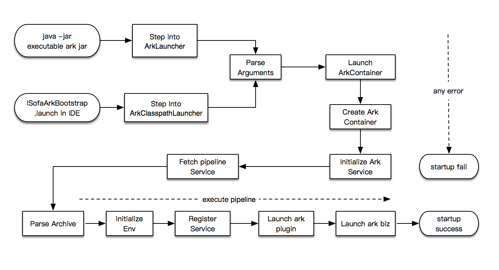

# Ark container start process

The startup process of the Ark container is illustrated as follows:



## ArkService

Ark Service is a service in the Ark container. The underlying layer uses Guice to manage the service. The service is provided with the lifecycle interface `com.alipay.sofa.ark.spi.service.ArkService`

```java
public interface ArkService {

    /**
     * Ark Service init
     * @throws ArkException
     */
    void init() throws ArkException;

    /**
     * Ark Service dispose
     * @throws ArkException
     */
    void dispose() throws ArkException;

}
```

After the service implements the preceding lifecycle interface, the Ark Service container invokes the interface when it starts and stops.

## Pipeline service

Pipeline is also a service registered in the Ark Service container. The service itself has no order or priority. The service is assembled in the Pipeline while the entire Ark container starts.

### Archive parsing
At the very beginning of Pipeline, the running fatjar will be resolved into the models required for runtime, including the Ark plug-in model and the Ark business model, which are registered to the `PluginManagerService` and the `BizManagerService` in the Ark Service.

### Deploy the Ark plug-in
Get all the Ark plug-ins from the `PluginManagerService` in the order of their priorities:
* ClassloaderService prepares for the map mapping of plug-in export class
* PluginDeployService starts `com.alipay.sofa.Ark.spi.service.PluginActivator`


### Start the Ark business
Get all the Ark business from the `BizManagerService`, and execute the entry main function provided by the business configuration in the Main-Class attribute of MANIFEST.MF.

