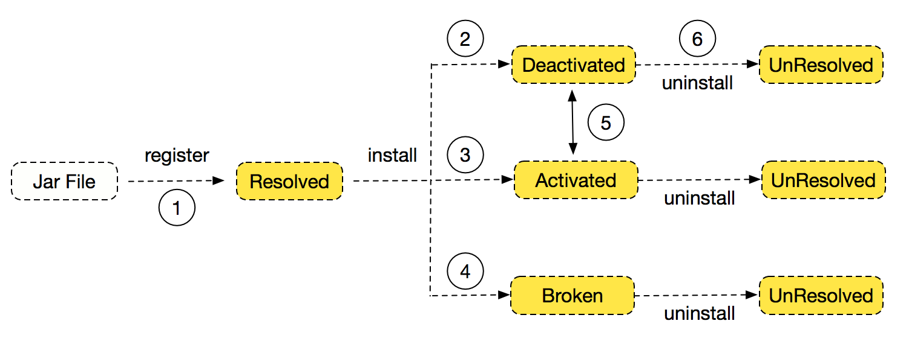

In the [Interactive Instructions](./jarslink-instruction.md) section, we have described the set of instructions that Jarslink2.0 supports. In this section, we will focus on all the possible state transitions behind these instructions in the following diagram of a Biz package being loaded from a static file to the runtime and to being uninstalled.

 

The diagram above basically shows the complete life cycle of a Biz package. Now we will explain the direction of each state transition in the diagram:

+ Label 1: Execute the install instruction, and Jarslink2.0 will resolve the file format. If the format is correct, it is the Biz package file, and the Biz package will be registered and installed.

+ Label 2: When the Biz package is successfully installed, the Biz package's main function is executed, the Spring context is loaded successfully, and passes the health check. If Biz packages with the same name but different versions are detected to be activated, the Biz package state will be set to an inactive state. The JVM services that are published by an inactive Biz package will not be called.

+ Label 3: When the Biz package is successfully installed, the Biz package's main function is executed, the Spring context is loaded successfully, and passes the health check. If Biz packages with the same name but different versions are detected to be activated, the Biz package state will be set as active and can provide services.

+ Label 4: If there are any exceptions or a health check failure, the Biz package state will be set to broken. During the installation, the resources that the Biz package occupies will be quickly released and unregistered, at which point the Biz state will be set to unresolved.

+ Label 5: When running, Jarslink2.0 can load Biz packages with the same name but different versions, but only one Biz package is in the active state and can provide services. Execute the switch instruction, and the two Biz packages' states will be interchanged.

+ Label 6: Execute the uninstallation instruction, the Biz package will be uninstalled, and its occupied resources and published services will be unregistered.
