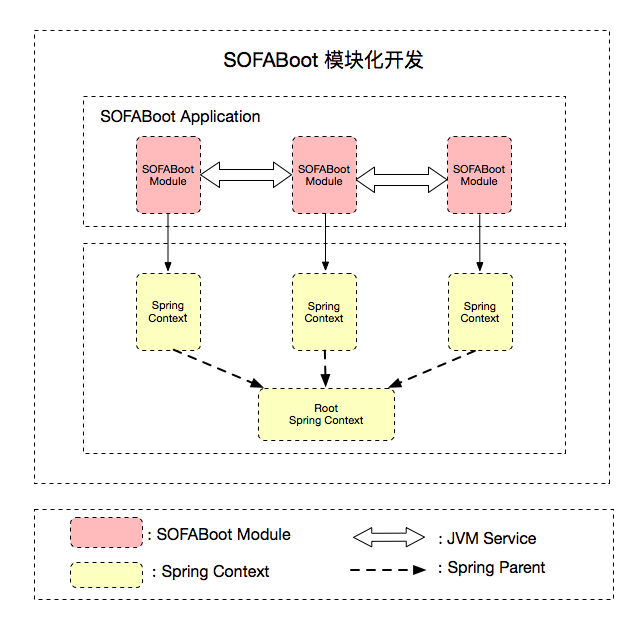

SOFABoot 从 2.4.0 版本开始支持基于 Spring 上下文隔离的模块化开发能力。为了更好的理解 SOFABoot 模块化开发的概念，我们来区分几个常见的模块化形式：

- 基于代码组织上的模块化：这是最常见的形式，在开发期，将不同功能的代码放在不同 Java 工程下，在编译期被打进不同 jar 包，在运行期，所有 Java 类都在一个 classpath 下，没做任何隔离；
- 基于 Spring 上下文隔离的模块化：借用 Spring 下文来做不同功能模块的隔离，在开发期和编译期，代码和配置也会分在不同 Java 工程中，但在运行期，不同的 Spring Bean 相互不可见，IoC 只在同一个上下文内部发生，但是所有的 Java 类还是在一个 ClassLoader 下；
- 基于 ClassLoader 隔离的模块化：借用 ClassLoader 来做隔离，每个模块都有独立的 ClassLoader，模块与模块之间的 classpath 不同，[SOFAArk](https://github.com/sofastack/sofa-ark) 就是这种模块化的实践方式。

SOFABoot 模块化开发属于第二种模块化形式 —— 基于 Spring 上下文隔离的模块化。每个 SOFABoot 模块使用独立的 Spring 上下文，避免不同 SOFABoot 模块间的 BeanId 冲突，有效降低企业级多模块开发时团队间的沟通成本。

关于 SOFABoot 模块化产生的背景，可参考文章《[蚂蚁金服的业务系统模块化 ---- 模块化隔离方案](https://www.sofastack.tech/posts/2018-07-25-01)》

## 功能简介

 

### 依赖引入
使用 SOFABoot 模块化开发方案，需要引入如下依赖：

```xml
<dependency>
    <groupId>com.alipay.sofa</groupId>
    <artifactId>isle-sofa-boot-starter</artifactId>
</dependency>
```

### SOFABoot 模块

SOFABoot 框架定义了 SOFABoot 模块的概念，一个 SOFABoot 模块是一个包括 Java 代码、Spring 配置文件、SOFABoot 模块标识等信息的普通 Jar 包，一个 SOFABoot 应用可以包含多个 SOFABoot 模块，每个 SOFABoot 模块都含有独立的 Spring 上下文。

以 SOFABoot 模块为单元的模块化方式为开发者提供了以下功能：

- 运行时，每个 SOFABoot 模块的 Spring 上下文是隔离的，模块间定义的 Bean 不会相互影响；
- 每个 SOFABoot 模块是功能完备且自包含的，可以很容易在不同的 SOFABoot 应用中进行模块迁移和复用，只需将 SOFABoot 模块整个拷贝过去，调整 Maven 依赖，即可运行。

SOFABoot 模块的格式定义见: [模块配置](./SOFABoot-Module)。

### SOFABoot 模块间通信

上下文隔离后，模块与模块间的 Bean 无法直接注入，模块间需要通过 SOFA 服务进行通信，目前SOFABoot 提供了两种形式的服务发布和引用，用于解决不同级别的模块间调用的问题：

- JVM 服务发布和引用：解决一个 SOFABoot 应用内部各个 SOFABoot 模块之间的调用问题， [JVM服务发布与引用](./Module-Service)
- RPC 服务发布和引用：解决多个 SOFABoot 应用之间的远程调用问题，[RPC服务发布与引用](https://github.com/sofastack/sofa-rpc/wiki/Publish-And-Reference)。

### 模块并行化启动

每个 SOFABoot 模块都是独立的 Spring 上下文，多个 SOFABoot 模块支持并行化启动，与 Spring Boot 的单 Spring 上下文模式相比，模块并行化启动能够加快应用的启动速度。

### Root Application Context

SOFABoot 应用运行时，本身会产生一个 Spring Context，我们把它叫做 Root Application Context，它是每个 SOFABoot 模块创建的 Spring Context 的 Parent。这样设计的目的是为了保证每个 SOFABoot 模块的 Spring Context 都能发现 Root Application Context 中创建的 Bean，这样当应用新增 Starter 时，不仅 Root Application Context 能够使用 Starter 中新增的 Bean，每个 SOFABoot 模块的 Spring Context 也能使用这些 Bean。