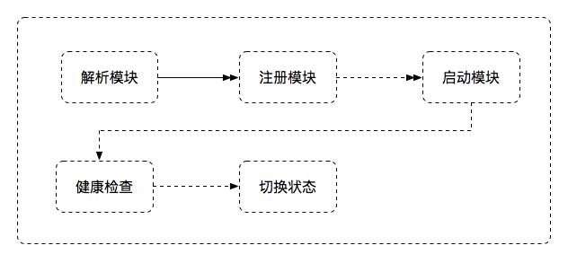
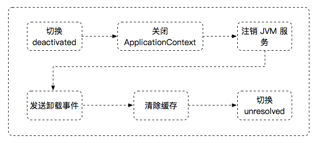

SOFAArk 合并部署时，除了宿主应用，其他 Biz 允许运行时动态部署和卸载。Biz 的状态如下：
+ unresolved: 未注册，此时 Biz 包未被运行时解析
+ resolved: Biz 包解析完成，且已注册，此时 Biz 包还没有安装或者安装中
+ activated: Biz 包启动完成，且处于激活状态，可以对外提供服务
+ deactivated: Biz 包启动完成，但出于未激活状态，模块多个版本时，只有一个版本出于激活状态(注意这个状态只对 JVM 服务生效，对 RPC 等其他中间件无效)
+ broken: Biz 包启动失败后状态

目前 SOFAArk 提供了三种方式操作 Biz:
+ 编程 API 
+ Zookeeper 动态配置
+ Telnet 指令

本质上，后两种都是通过编程 API 操作 Biz，所以在这里详细描述通过编程 API 控制 Biz 的生命周期。SOFAArk 提供客户端 ArkClient 操作 Biz, 主要包含三条指令：
+ install: 安装 Biz，虽然有多个重载方法，本质是接受 bizFile 文件作为入参
+ uninstall: 卸载 Biz，运行时 Biz 是由 bizName 和 bizVersion 唯一确定的，因此需要这两个入参
+ switch: 激活 Biz，SOFAArk 运行部署多个相同名称不同版本的 Biz，但是运行时只有一个 Biz 被激活（JVM 服务对外可用）；当使用 switch 指令激活其他版本时，当前处于激活状态的 Biz 将切换到钝化，同样也需要 bizName 和 bizVersion 作为入参

**注意：部署相同名称不同版本 Biz 时，如果已有激活的版本，后续部署的其他版本 Biz 将自动处于钝化状态**

### 安装 Biz
以 Spring Boot/SOFABoot 为例，应用(模块)安装包含以下流程：

+ 解析模块
> SOFAArk 容器会解析文件流，读取 Biz 配置，创建 BizClassLoader 等，生成 Biz 运行时模型

+ 注册模块
> 注册解析后的 Biz 模型，设置状态为 resolved

+ 启动模块
> 执行 Biz 的入口方法，完成上下文的刷新，如果报错则对外抛出异常

+ 健康检查
> 启动完成，此时 Biz 还没有切换至下一个状态，将会执行应用健康检查，健康检查[参考 SOFABoot 文档](https://www.sofastack.tech/sofa-boot/docs/HealthCheck)，健康检查失败则抛出异常，如果应用没有引入 SOFABoot 健康检查依赖，则跳过

+ 切换状态
> 健康检查成功，会切换 Biz 状态；如果不存在其他版本 Biz 处于激活状态，则切换状态至 Activated，否则切换状态至 DeActivated

**注意：启动模块时抛出异常，均导致 Biz 启动失败，可以查看 sofa-ark/common-error.log 日志**

### 卸载 Biz
应用（模块）卸载包含以下流程：

+ 切换 Biz 状态至少 deactivated
> 钝化 Biz, 防止流量进入正在卸载的 Biz

+ 关闭 ApplicationContext
> 关闭 Biz 的 Spring 上下文，如果用户需要自定义卸载操作，可以监听 `ContextClosedEvent` 事件

+ 注销 JVM 服务
> SOFAArk 运行时注销 Biz 发布的 JVM 服务

+ 发送卸载事件
> 通知所有 Ark Plugin 和 Ark Biz，正在卸载某个 Biz 

+ 清楚缓存
> SOFAArk 运行时注销所有和该 Biz 相关的缓存

+ 切换 Biz 状态为 unresolved
> Biz 执行完所有卸载操作时，将状态置为 unresolved

#### 卸载面临的挑战
卸载 Biz 最大的挑战在于 ClassLoader 的卸载，如果 ClassLoader 没有卸载干净，极有可能会导致 metaspace OOM. JDK 对 Class 的回收条件非常苛刻，包含：

+ 该类所有实例都已经回收
+ 加载该类的 ClassLoader 已经回收
+ 该类对应的 java.lang.Class 对象已经没有在任何地方被引用，无法在任何地方通过反射访问该类的方法

每个 Biz 都由独立的 BizClassLoader 加载，只要该 Biz 的加载的类或对象或 ClassLoader 被其他 Biz 或 Plugin 引用，则会导致 Biz 无法卸载成功

### 激活 Biz
激活指令用于设置 Biz 状态为 Activated，如果此时已有其他版本 Biz 处于激活状态，则先设置其为 Deactivated，再激活指定的 Biz 为 Activated. 激活状态是相对 JVM 服务而言，只有被激活的 Biz，其发布的 JVM 服务才能被其他 Biz 引用