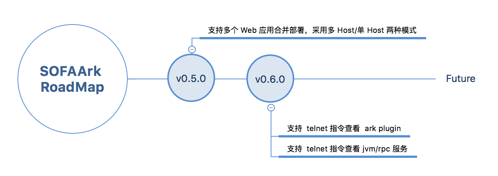

## 发展路线

## 任务列表

下面表格记录了还没有实现的功能特性，欢迎大家认领任务，[参与贡献](./contribution)。

| 类型 | 任务 | 困难度 | 认领人及时间 | 计划完成时间 | 进度 | 相关 Issue |
|---|---|---|---|---|---|---|
|代码|支持多个 Web 应用合并部署，采用多 Host/单 Host 两种模式|难| | | |
|代码|支持 telnet 指令查看 ark plugin|简单| | | |
|代码|支持 telnet 指令查看 jvm/rpc 服务|中| | | |

## 版本迭代计划

### v0.5.0 
+ 支持多个 Web 应用合并部署，采用多 Host/单 Host 两种模式

### v0.6.0
+ 支持 telnet 指令查看 ark plugin；
+ 支持 telnet 指令查看 jvm/rpc 服务；

