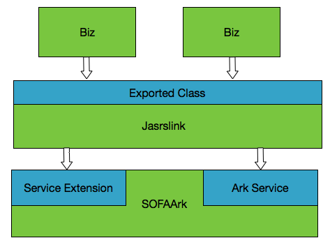

## 架构图
Jarslink2.0 是一个 Ark Plugin，运行时需要依赖 SOFAArk 容器。Jarslink2.0 在运行时处于中间层，上承应用，下接容器。边界交互方式：
+ 1、应用边界：Jarslink2.0 配置导出类，应用可以直接使用这些类，实际在运行时，这些类都是委托给 Jarslink 加载。
+ 2、容器边界：Ark Plugin 可以通过 SOFAArk 容器暴露出来的扩展点和服务，跟容器交互。Jarslink 扩展了 `BizDeployer` 实现，并引用了 `BizManagerService` 和 `BizFactoryService` 容器服务。

## 模块划分
各个模块的实现类都只在自己模块中出现，一般不交叉依赖。需要交叉依赖都会移入 core 模块。详细模块描述见下表：

| 模块名 | 子模块名 | 说明 | 依赖关系 |
|---|---|---|---|
|bom| |依赖版本管控|无|
|core|common|公共模块，包含日志类|无|
|core|spi|SPI 模块，定义基本的接口、指令|无| 
|core-impl|runtime|Jarslink 运行时管理，处理指令|core|
|integration| |ark plugin 打包模块，实现 SOFAArk 容器服务扩展点，引用容器服务|all|

