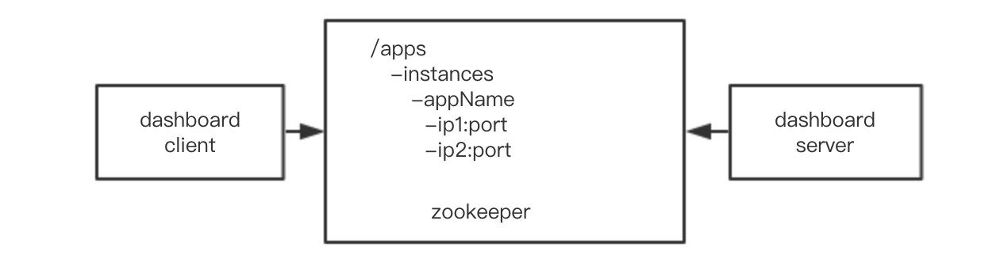
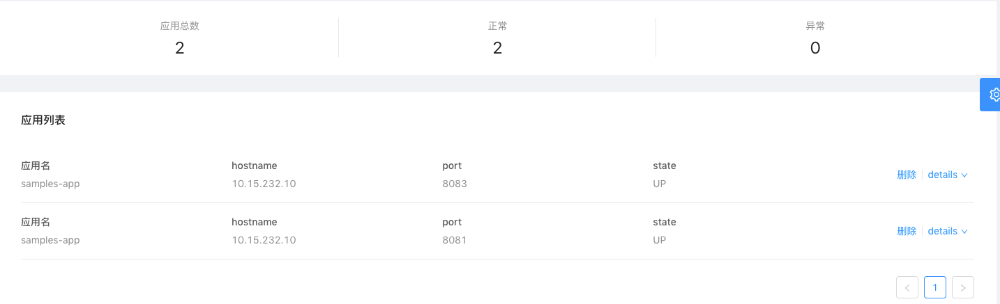

## SOFADashboard 客户端

### 简介

SOFADashboard client 用于向 SOFADashboard 服务端注册应用信息。实际上 SOFADashboard client 并非是直接通过 api 调用的方式将自身应用信息直接注册到 SOFADashboard 服务端 ，而是借助于 Zookeeper 来完成。

客户端向 zookeeper 中如上图所示的节点中写入数据，每一个 ip:port 节点代表一个应用实例，应用本身信息将写入当前节点的 data 中。

SOFADashboard 服务端在启动期会去指定的目录节点下拉取一次应用数据，然后监听 /apps 下的节点事件。

### 功能展示

