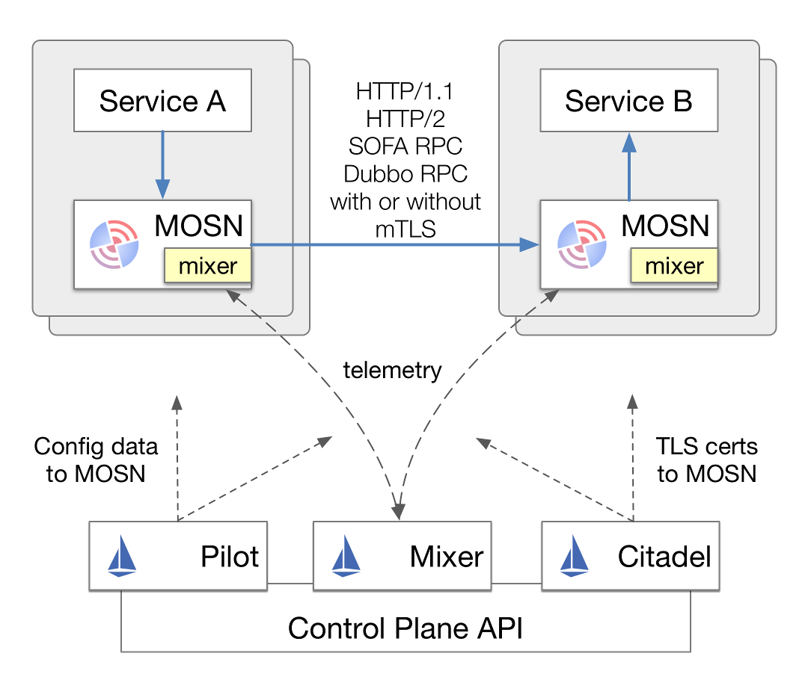
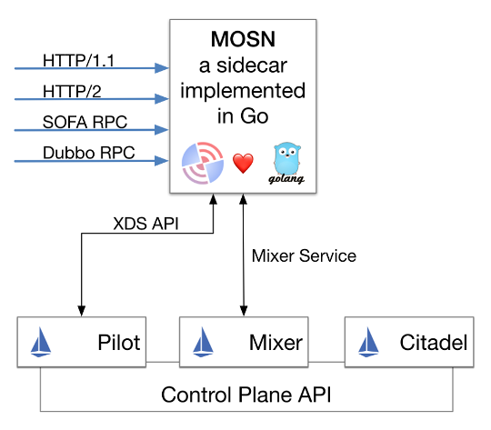

## SOFAMesh 简介

## 概述

SOFAMesh 是基于 Istio 改进和扩展而来的 Service Mesh 大规模落地实践方案。在继承 Istio 强大功能和丰富特性的基础上，为满足大规模部署下的性能要求以及应对落地实践中的实际情况，有如下改进：

1. 采用 Golang 编写的 MOSN 取代 Envoy
2. 合并Mixer到数据平面以解决性能瓶颈
3. 增强 Pilot 以实现更灵活的服务发现机制
4. 增加对 SOFA RPC、Dubbo 的支持

下图展示了SOFAMesh 和 Istio 在架构上的不同：

## 主要组件

### SOFA MOSN

SOFAMesh 中，我们采用 Golang 语言编写了名为 MOSN（Modular Observable Smart Net-stub）的模块，实现了 Envoy 的功能，完全兼容 Envoy 的 API，在数据平面中承担 Sidecar 功能以替代 Envoy 实现和 Istio 集成。

### SOFA Pilot

SOFAMesh 中大幅扩展和增强 Istio 中的 Pilot 模块：

1. 增加 SOFA Registry 的 Adapter，提供超大规模服务注册和发现的解决方案
2. 增加数据同步模块，以实现多个服务注册中心之间的数据交换
3. 增加 Open Service Registry API，提供标准化的服务注册功能

MOSN 和 Pilot 配合，将可以提供让传统侵入式框架（如 Spring Cloud、Dubbo、SOFA RPC 等）和 Service Mesh 产品可以相互通讯的功能，以便可以平滑的向 Service Mesh 产品演进和过渡。

## 开源共建

SOFAMesh的初始版本由蚂蚁金服和阿里大文娱UC事业部携手贡献，期待社区一起来参与后续开发，共建一个开源精品项目。