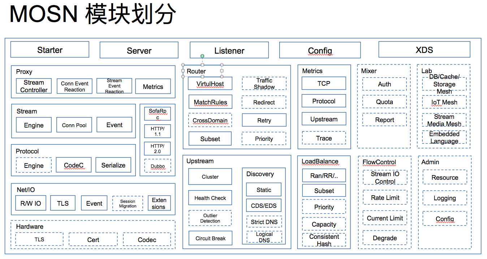
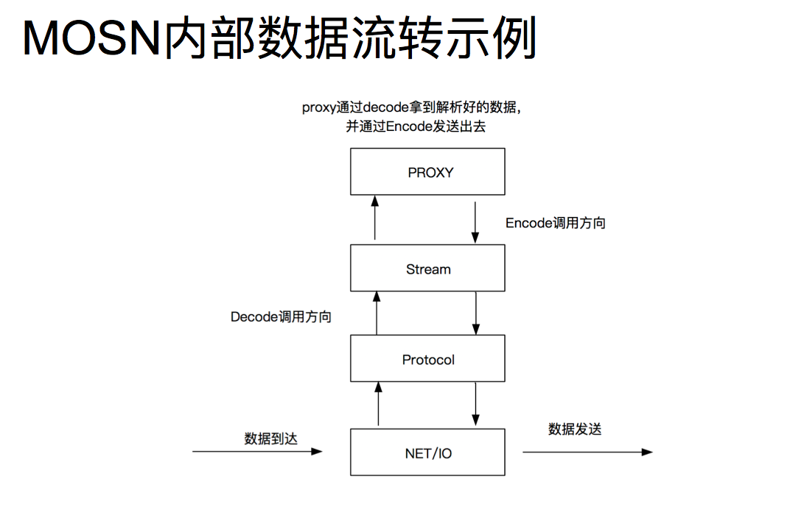

# MOSN 架构简介

MOSN 的组成由 Net/IO、Protocol、Stream、Proxy 四层组成，具体请参见 [MOSN 架构](architecture.md)。

## MOSN 工作流程

下图展示的是使用 Sidecar 方式部署运行的 MSON 的示意图，您可以设置 MOSN 的上游和下游协议。

## MOSN 模块划分

下图展示的是组成 MOSN 的模块，关于各个模块的详细信息请参考[模块详情介绍](MosnModulesDescribe.md)。

## MOSN 内部数据流

MOSN 内部数据流如下图所示。

