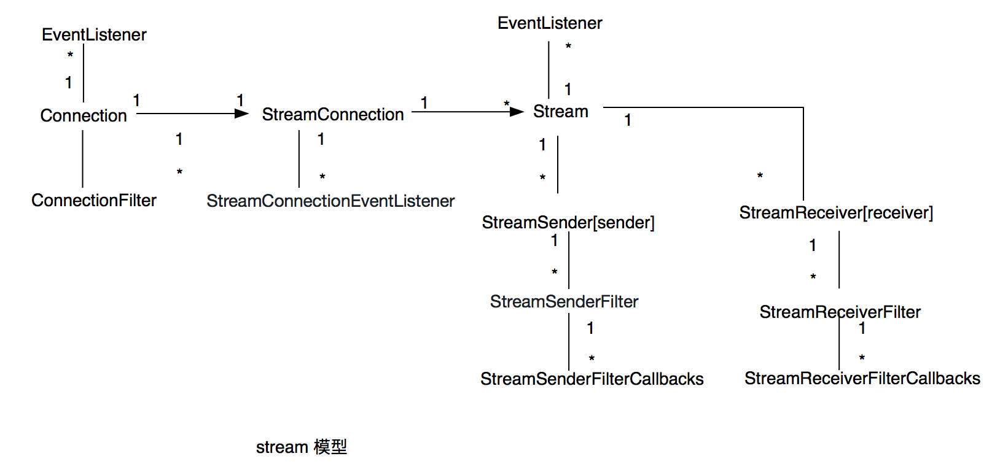

# MOSN 架构设计

在 MOSN 中，通过自底向上的 NET/IO, Protocol, Stream, Proxy 四层来构建高性能的转发系统，其中

+ Net/IO 层是用来支撑上层功能的核心层，由 `Listener` 和 `Connection` 组成。其中，Listener 用来监听端口，并接收新连接。
  Connection 用来管理 Listener 上 accept 的 tcp 连接，包括从 tcp conn 上读写数据等，接口定义在:
  ```bash
    sofamosn/pkg/types/network.go
  ```
    + 下图为 Listener 和 Connection 的关系图:
      
      
      如图中所示，每个 Listener 上可以创建多个 Connection, 同时为了满足一些定制功能的需要,
      Listener 和 Connection 均以 filter chain 的形式提供可扩展机制, 如下所示：
      
      + Listener:
        + Event listener
            + ListenerEventListener 用于订阅 Listener 上的重要事件，包括新连接的建立、MOSN连接的建立、以及关闭监听器等，需要注意的是，
            这里的事件的执行并不会影响主流程
        + Filter
            + ListenerFilter 它定义了一些钩子函数，通过在注册的位置触发回调来与核心模型进行交互，回调的结果(状态码)
            会影响主流程的执行，当前支持两个状态码，分别是 `Continue`  继续执行 以及`StopIteration` 停止当前的执行逻辑
      
      + Connection:
        + Event listener
            + ConnectionEventListener 定义了 Connection 上事件的回调机制，包括主动发起连接、在连接上发送数据、连接关闭等
        + Filter
            + ReadFilter 在读取完 conn 上到达的字节流后调用，将读取到的数据分发到对应的处理单元
            + WriteFilter 在将数据写到 conn 时被调用
  

+ Protocol 层用于做不同协议的编解码、进行二进制流和协议 command 的转化，并连接 IO 层和 Stream 层之间的处理逻辑。接口定义在
  ```bash
    sofamosn/pkg/types/protocol.go
  ```
   在具体的处理中，
  MOSN 在收到二进制的数据后，根据配置的下游协议选择对应的解码器，将协议 decode
  成 headers, body, 以及 trailer 三部分，之后通过 stream 层的回调接口将数据上传到 stream 层进行 stream 创建，并在 proxy 层完成往 upstream 的转发封装后，
  再次通过 stream 层调用 protocol 的编码器将数据包编码成二进制流。

+ Stream 层通过封装 `stream`，使用全局唯一的 stream id 关联 request 和 response 报文来实现一个连接上的多路复用，以此达到高效通信的目的。
  下图为 stream 和 connection 对应的关系图
   
 
 如图中所示，一个 Connection 对应一个 StreamConnection 用来管理多个 stream，在具体的实现中 StreamConnection 将 conn 上获取的数据
 分发到不同的协议的解码器上做解码，并生成具体的stream，其中 `StreamConnectionEventListener` 用来监听其上的事件，当前仅支持 "OnGoAway"
 
 而构成 stream layer 的核心数据结构 `stream` 具有如下的一些接口，
 其中为了满足 stream 在 encode/decode 处理过程中扩展的需要，filter chain 被引入
 
 + Stream
    + Encoder 
      + StreamSender 用来编码 request/response stream 为二进制然后发送， 'endStream' 标识符用来标志后序是否还有数据，在设置为 true 的情况下，
    无需等待直接发送 
        + StreamSenderFilter 在 stream 发送时定义的一些钩子函数用来处理特定逻辑
        + StreamSenderFilterCallbacks
    + Decoder
      + StreamReceiver 用于处理接收到的二进制流，在 IO 接收到二进制并解码成对应的 request/response 后会被调用
        + StreamReceiverFilter 在 封装 stream 的时候定义的一些钩子函数来处理特定逻辑，例如 `故障注入`以及`心跳包回复`等
        + StreamReceiverFilterCallbacks
      
    + Event listener
      + StreamEventListener 用于 stream 相关事件发生时的调用，比如 StreamEventListener 被reset的时候

 + 另外，Stream 没有预先设定的方向，所以 StreamSender 可作为 client 来 encode request 也可以作为 server 来 encode response，而 StreamReceiver 
  在client 的场景下可以用来 decode response，在server的场景下可以用来 decode request
 + 需要注意的是，由于封装格式等不同，不同的协议需要实现对应协议的 stream

+ Proxy 是实现请求转发的核心模型，通过将 stream 在 downStream 和 upStream 之间做传递，并通过 stream id 做关联，实现
  代理功能。同时 Proxy 中实现了路由管理，以及连接池管理，cluster管理等功能。并且，proxy 的能力是协议无关的，他通过配置的上下游协议
  来选择不同协议实现的stream