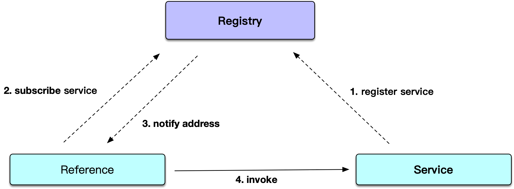

### Product introduction

SOFARPC is a Java-based RPC service framework open sourced by Ant Financial, which provides remote service call between applications, high scalability and fault tolerance features. Currently, all RPC calls of Ant Financial businesses use SOFARPC. SOFARPC provides users with functions such as load balancing, traffic forwarding, link tracing, link data transparent transmission, and fault removal.

In addition, SOFARPC supports different protocols, currently including [bolt](./Bolt), [RESTful](./RESTful), [dubbo](./Dubbo), and [H2C](./H2c). Bolt is a network communication framework based on Netty developed by Ant Financial Services Group.

### Implementation principle

1. When an SOFARPC application is started, if the current application needs to publish RPC services, SOFARPC will register these services to the service registry center. As shown in the figure, the service points to the Registry.
2. When the SOFARPC application that references this service is started, it subscribes to the metadata information of the corresponding service from the service registry. After receiving the subscription request, the service registry will push the publisher's metadata list to the service reference party in real time. As shown in the figure, Register points to Reference.
3. When the service reference party gets the addresses, it can pick up the address and initiate the call. As shown in the figure, Reference points to Service.