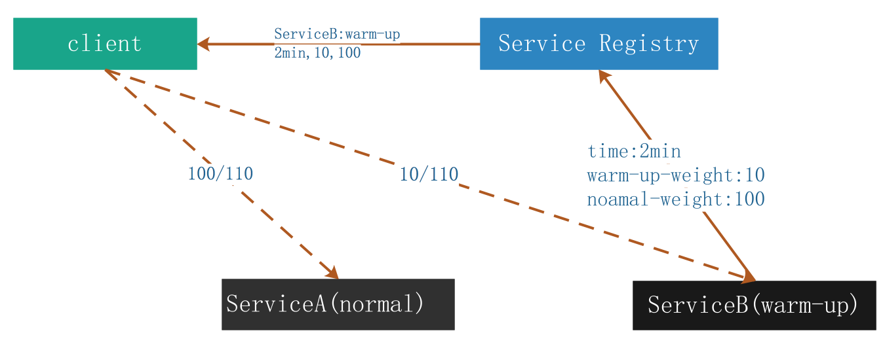

## Warm-up weight

The warm-up weight feature allows the client machine to distribute traffic based on the corresponding weight of the server. This feature is also often used in the scenario where a few machines within a cluster are being started. The server machines can be warmed up in a short time with the traffic weight function, and then continue to receive the normal traffic.

The operating mechanism is as follows:


1. When the server service starts, it pushes its own warm-up duration, weight during warm-up, and normal weight after warm-up to the Service Registry. As shown above, Service B points to Service Registry.

2. When referencing service, the client obtains the warm-up weight information of each service instance. As shown above, Service Registry points to client.

3. When calling service, the client distributes the traffic according to the warm-up weight of the address where the service is located. As shown above, the client points to Service A and Service B. Service A has completed warm-up, and its weight is 100 by default. Service B is in the warm-up period, and its weight is 10. Therefore, their traffic is 100%110 and 10%110 respectively.

This feature is used as follows:

```java
ProviderConfig<HelloWordService> providerConfig = new ProviderConfig<HelloWordService>() 
            .setWeight(100) 
            .setParameter(ProviderInfoAttrs.ATTR_WARMUP_WEIGHT,"10") 
            .setParameter(ProviderInfoAttrs.ATTR_WARM_UP_END_TIME, "12000");
```

As above, the warm-up duration of the service is 12s, the weight is 10 during warm-up, and the normal weight after warm-up is 100. If the service is published on two machines, such as machine A and B, and the machine A is in the warm-up period with the above configuration, while B has already completed warm-up, and the normal weight is 200, then when the client calls the service, the proportion of traffic distribution is 10:200. After the machine A is warmed up, the traffic distribution ratio is 100:200.

In SOFABoot, the warm-up duration and the weight during and after warm-up can be configured as follows:

```xml
<sofa:reference id="sampleRestFacadeReferenceBolt" interface="com.alipay.sofa.endpoint.facade.SampleFacade">
    <sofa:binding.bolt>
         <sofa:global-attrs weight="100" warm-up-time="10000" warm-up-weight="1000"/>
     </sofa:binding.bolt>
</sofa:reference>
```