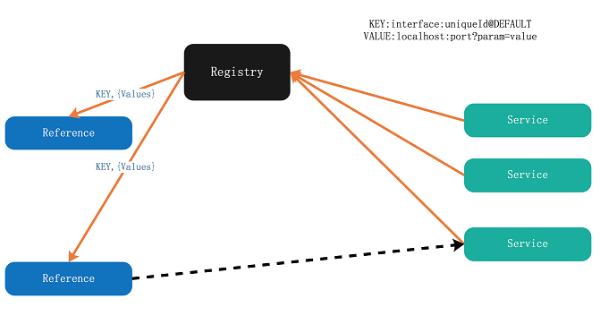

### 项目简介

SOFARPC 是蚂蚁金服开源的一款基于 Java 实现的 RPC 服务框架，为应用之间提供远程服务调用能力，具有高可伸缩性，高容错性，目前蚂蚁金服所有的业务的相互间的 RPC 调用都是采用 SOFARPC。SOFARPC 为用户提供了负载均衡，流量转发，链路追踪，链路数据透传，故障剔除等功能。 

SOFARPC 还支持不同的协议，目前包括 [bolt](./Bolt)，[RESTful](./RESTful)，[dubbo](./Dubbo)，[H2C](./H2c) 协议进行通信。其中 bolt 是蚂蚁金融服务集团开放的基于 Netty 开发的网络通信框架。

### 基本原理

1. 当一个 SOFARPC 的应用启动的时候，如果发现当前应用需要发布 RPC 服务的话，那么 SOFARPC 会将这些服务注册到服务注册中心上。如图中 Service 指向 Registry。
2. 当引用这个服务的 SOFARPC 应用启动时，会从服务注册中心订阅到相应服务的元数据信息。服务注册中心收到订阅请求后，会将发布方的元数据列表实时推送给服务引用方。如图中 Registry 指向 Reference。
3. 当服务引用方拿到地址以后，就可以从中选取地址发起调用了。如图中 Reference 指向 Service。

