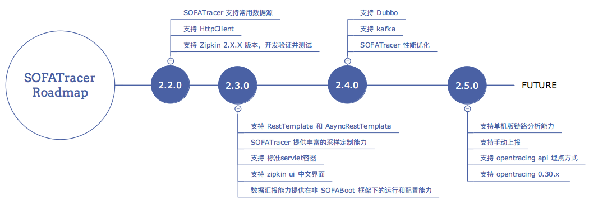

## 发展路线

 

## 任务列表

欢迎大家领取任务[参与贡献](https://github.com/alipay/sofa-tracer/blob/master/CONTRIBUTING.md)。

| 类型 | 任务 | 困难度 | 认领人及时间 | 计划发布时间 | 计划完成时间 | 进度 | 相关 issue 
| --- | ---- | ---- | ---- | --- | ---- | ---- | ---- |
| 代码 | SOFATracer 性能优化专题 | 高 |  |  |  |  | [issue 18](https://github.com/alipay/sofa-tracer/issues/18) 和 [issue 11](https://github.com/alipay/sofa-tracer/issues/11)
| 代码 | SOFATracer 支持 HttpClient | 中 |  |  |  | 已经完成，见 [HttpClient 接入文档](./Usage_Of_HttpClient) | [issue 17](https://github.com/alipay/sofa-tracer/issues/17) |
| 代码 | SOFATracer 数据汇报能力提供在非 SOFABoot 框架下的运行和配置能力 | 中 |  |  |  |  | [issue 32](https://github.com/alipay/sofa-tracer/issues/32) |
| 代码 | SOFATracer 提供采样能力 | 中 |  |  |  |  | [issue 10](https://github.com/alipay/sofa-tracer/issues/31) |
| 代码 | SOFATracer 支持 Zipkin 2.X.X 版本 | 中 |  |  |  |  | [issue 23](https://github.com/alipay/sofa-tracer/issues/23) |
| 代码 | SOFATracer 支持  Druid | 中 |  |  |  | 已经完成，见 [DataSource 接入文档](./Usage_Of_Datasource) |  |
| 代码 | SOFATracer 支持  c3p0 | 中 |  |  |  | 已经完成，见 [DataSource 接入文档](./Usage_Of_Datasource) |  |
| 代码 | SOFATracer 支持  Tomcat-JDBC | 中 |  |  |  | 已经完成，见 [DataSource 接入文档](./Usage_Of_Datasource) |  |
| 代码 | SOFATracer 支持  HikariCP | 中 |  |  |  | 已经完成，见 [DataSource 接入文档](./Usage_Of_Datasource) |  |
| 代码 | SOFATracer 支持  dbcp  | 中 |  |  |  | 已经完成，见 [DataSource 接入文档](./Usage_Of_Datasource) |  |
| 代码 | SOFATracer 支持  dbcp2 | 中 |  |  |  | 已经完成，见 [DataSource 接入文档](./Usage_Of_Datasource) |  |
| 代码 | SOFATracer 支持 [Sharding-JDBC](https://github.com/sharding-sphere/sharding-sphere) | 中 |  |  |  |  |  |
| 代码 | SOFATracer 支持 Mysql JDBC Driver | 中 |  |  |  |  |  |
| 代码 | SOFATracer 支持  Oracle JDBC Driver | 中 |  |  |  |  |  |
| 代码 | SOFATracer 支持 Dubbo | 中 |  |  |  |  |  |
| 代码 | SOFATracer 支持 RestTemplate 和 AsyncRestTemplate | 中 |  |  |  |  |  |
| 代码 | SOFATracer 支持 HttpServer Tomcat 8/9 | 中 |  |  |  |  |  |
| 代码 | SOFATracer 支持单机版链路分析并给用户通过注解使用的埋点方式，数据汇报到 Zipkin | 中 |  |  |  |  |  |
| 代码 | SOFATracer 支持 Jetty9 | 中 |  |  |  |  |  |
| 代码 | SOFATracer 支持  Kafka | 中 |  |  |  |  |  |
| 代码 | SOFATracer 支持  Redis | 中 |  |  |  |  |  |
| 代码 | SOFATracer 支持  hystrix  | 中 |  |  |  |  |  |
| 文档 | 文档翻译 | 中 |  |  |  |  |  |

## 版本迭代计划

### 2.2.0 

* SOFATracer 性能优化专题
* SOFATracer 支持 HttpClient
* SOFATracer 数据汇报能力提供在非 SOFABoot 框架下的运行和配置能力
* SOFATracer 提供采样能力
* SOFATracer 支持 Zipkin 2.X.X 版本，开发验证并测试

### 2.3.0

* SOFATracer 支持 Mysql Driver
*  SOFATracer 支持 [Sharding-JDBC](https://github.com/sharding-sphere/sharding-sphere)
* SOFATracer 支持  Mysql-JDBC
* SOFATracer 支持  Druid 
* SOFATracer 支持  c3p0 
* SOFATracer 支持  Tomcat-JDBC
* SOFATracer 支持  HikariCP 

### 2.4.0

* SOFATracer 支持 Dubbo
* SOFATracer 支持 RestTemplate 和 AsyncRestTemplate
* SOFATracer 支持 HttpServer Tomcat 8
* SOFATracer 支持 HttpServer Tomcat 9

### 2.5.0

* SOFATracer 支持单机版链路分析并给用户通过注解使用的埋点方式，数据汇报到 Zipkin 展示
* SOFATracer 支持 Jetty9
* SOFATracer 支持  dbcp 
* SOFATracer 支持  dbcp2

